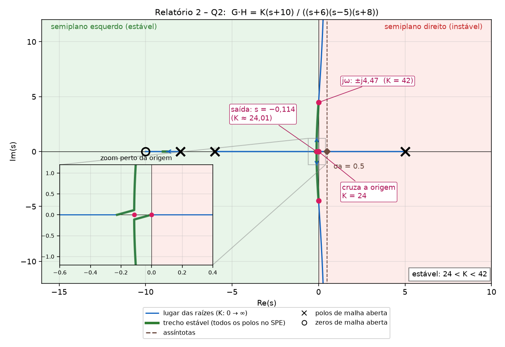
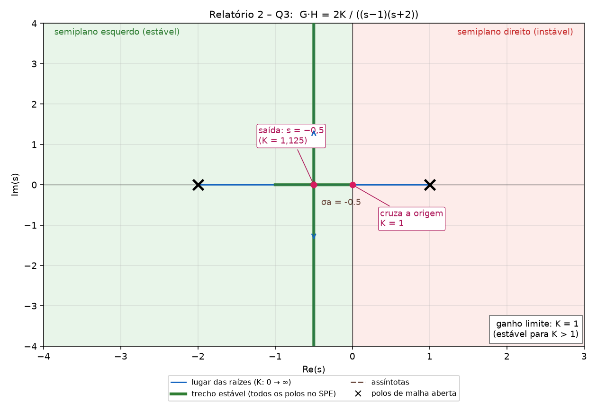
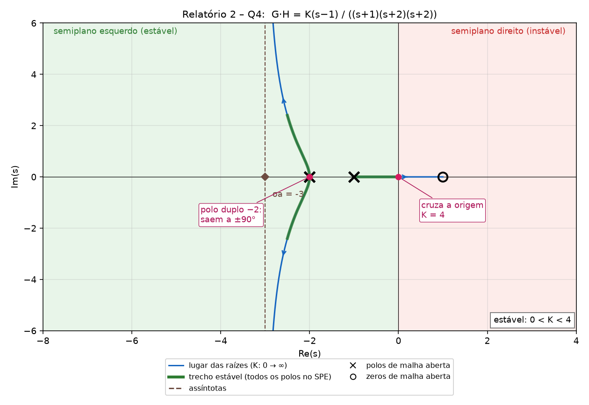

# Gabarito comentado: Relatório 2 (Lugar das Raízes e Routh)

Arquivo: `Exercícios/Relatório 2 - Lista de Exercícios Sobre o Lugas das Raízes.pdf`. Usa os passos do professor da Aula 8 (resumidos em [Resumo_Controle_P1.md §10](Resumo_Controle_P1.md#s10)) e o Routh da Aula 6 ([§8](Resumo_Controle_P1.md#s8)).

Verifiquei numericamente todas as faixas de K e pontos calculados (raízes do polinômio característico para valores de K dentro e fora das faixas). Os desenhos abaixo são descritos em texto; **você precisa desenhar**, e depois confirmar com `rlocus` (código no fim).

## Roteiro do professor (vale para as Q2, Q3 e Q4)

1. Polos (x) e zeros (o) de malha aberta `G·H`.
2. Eixo real: lugar **à esquerda de um número ÍMPAR** de polos + zeros (K > 0).
3. Nº de ramos = nº de polos `n`; `m` terminam nos zeros, `n−m` vão ao infinito.
4. Assíntotas: `σa = (Σpolos − Σzeros)/(n−m)`, `θa = (2k+1)·180°/(n−m)`.
5. Pontos de saída/entrada: `A'B − AB' = 0` (de `1 + K·B/A = 0`); só vale a raiz **sobre o lugar real**.
6. Cruzamento com jω: **Routh** com K; o K limite zera a linha s¹ (ou s⁰), e a equação auxiliar (linha s²) dá `s = ±jω`.
7. Estável quando **todos os polos de malha fechada** estão no semiplano esquerdo: a faixa de K vem do Routh.

Verificação útil: se `n − m ≥ 2`, a **soma dos polos de malha fechada é constante** (igual à soma dos polos de malha aberta), para qualquer K.

---

## Q1: faixa de K para estabilidade

`T(s) = (s³ − 4s − 11)/(s⁵ + s⁴ + 4s³ + 2s² + 3s + 1 − k)`

**Passo 1: polinômio característico.** O **denominador** de T. (O numerador, os zeros, não afeta a estabilidade.)
`A(s) = s⁵ + s⁴ + 4s³ + 2s² + 3s + (1 − k)`

**Passo 2: coeficientes.** Todos positivos exceto possivelmente `(1−k)`. Já exige `1 − k > 0` → `k < 1`. (Mas positivo não basta: tabela.)

**Passo 3: tabela de Routh.**

| Linha | 1ª col. | 2ª col. | 3ª col. |
|---|---|---|---|
| s⁵ | 1 | 4 | 3 |
| s⁴ | 1 | 2 | 1 − k |
| s³ | `b1 = (1·4 − 1·2)/1 = 2` | `b2 = (1·3 − 1·(1−k))/1 = 2 + k` | 0 |
| s² | `c1 = (2·2 − 1·(2+k))/2 = (2 − k)/2` | `c2 = (2(1−k) − 1·0)/2 = 1 − k` | |
| s¹ | `d1 = (c1(2+k) − 2·c2)/c1 = k(4 − k)/(2 − k)` | | |
| s⁰ | `1 − k` | | |

Conta de `d1`: numerador `(2−k)(2+k)/2 − 2(1−k) = (4 − k² − 4 + 4k)/2 = k(4−k)/2`; dividindo por `c1 = (2−k)/2` dá `k(4−k)/(2−k)`.

**Passo 4: 1ª coluna toda positiva.**
- `1, 1, 2` já são positivos.
- `c1 = (2−k)/2 > 0` → `k < 2`
- `d1 = k(4−k)/(2−k) > 0`, com `k < 2` (logo `2−k > 0`) → `k(4−k) > 0` → `0 < k < 4` → com `k<2`: `0 < k < 2`
- `s⁰`: `1 − k > 0` → `k < 1`

**Interseção:** `0 < k < 1`.

**Código MATLAB (Q1), no formato do professor.** Aqui o `k` aparece só no termo constante: `s⁵+s⁴+4s³+2s²+3s+(1−k) = 0` equivale a `1 + k·G(s) = 0` com `G = −1/(s⁵+s⁴+4s³+2s²+3s+1)`. Então o `rlocus` de `G` mostra os polos para `k` de 0 a ∞.

```matlab
clear all
clc
G=tf(-1,[1 1 4 2 3 1])      %F.T. Ramo direto (o -1 faz o termo constante virar 1-k).
H=tf([1],[1])               %F.T. Ramo feedback.
A=G*H                       %F.T. Malha aberta.
rlocus(A)                   %Root Locus (k de 0 a infinito).
axis([-1.5 1 -2.5 2.5])     %Limites dos eixos do gráfico [Xmin Xmax Ymin Ymax].
grid on

% Conferência da faixa 0 < k < 1 (polos de malha fechada para alguns k)
for k = [-0.5 0.5 0.99 1.01]
    fprintf('k = %5.2f   parte real máxima = %8.4f
', k, max(real(roots([1 1 4 2 3 1-k]))));
end
% Esperado: negativa para k=0,5 e 0,99 (estável); positiva para k=-0,5 e 1,01 (instável).
```
No gráfico, a curva corta o eixo imaginário perto de `k = 0` (par em ±j) e passa pela origem em `k = 1`.

**Resposta: estável para 0 < k < 1.**
Bordas: `k = 1` dá `s⁰ = 0` (polo em s = 0); `k = 0` dá `d1 = 0` (polos em jω). Verifiquei: em `k = 0,5` todos os polos no SPE; em `k = −0,5` e `k = 1,01` há polos no SPD.

---

## Q2: `G·H = K(s + 10)/((s + 6)(s − 5)(s + 8))` (realimentação negativa)

**Passo 1: polos e zeros.** Polos: **−8, −6, +5** (o +5 é instável em malha aberta!). Zero: **−10**. `n = 3`, `m = 1`.

**Passo 2: eixo real.** Conte polos+zeros à **direita** de cada ponto:
- entre −6 e +5: 1 (o pólo +5) → **ímpar → tem lugar** ✔
- entre −8 e −6: 2 → não
- entre −10 e −8: 3 → **ímpar → tem lugar** ✔
- à esquerda de −10: 4 → não

**Passo 3: ramos.** 3 ramos: 1 termina no zero −10, `n − m = 2` vão ao infinito.

**Passo 4: assíntotas.**
`σa = (−8 − 6 + 5 − (−10))/(3 − 1) = (−9 + 10)/2 = +0,5`
`θa = (2k+1)·180°/2 = 90°, 270°`
(Cruzam o eixo real em **+0,5**, então os dois ramos que vão ao infinito seguem para o **semiplano direito**.)

**Passo 5: ponto de saída.** `A = (s+6)(s−5)(s+8) = s³ + 9s² − 22s − 240`, `B = s + 10`.
`A'B − AB' = (3s² + 18s − 22)(s + 10) − (s³ + 9s² − 22s − 240) = 2s³ + 39s² + 180s + 20 = 0`
Raízes: `−12,18`, `−7,21`, `−0,114`.
- −12,18: fica à esquerda de −10 (região sem lugar) → **descarta**
- −7,21: entre −8 e −6 (sem lugar) → **descarta**
- **−0,114**: entre −6 e +5 (tem lugar) → **ponto de saída**, `K = −A/B ≈ 24,01`

(Entre −10 e −8 o lugar vai do polo −8 ao zero −10: pólo e zero adjacentes, **sem** ponto de saída.)

**Passo 6: cruzamento com jω (Routh).** `s³ + 9s² + (K − 22)s + (10K − 240) = 0`

| | | |
|---|---|---|
| s³ | 1 | K − 22 |
| s² | 9 | 10K − 240 |
| s¹ | `(9(K−22) − (10K−240))/9 = (42 − K)/9` | 0 |
| s⁰ | 10K − 240 | |

- `s⁰ > 0` → `K > 24`
- `s¹ > 0` → `K < 42`
- (`s³` e `s²` ok; com `K > 24` a coluna 2 da linha s³ também ≥ 0.)

Cruzamentos:
- `K = 42`: linha s¹ zera; equação auxiliar (s²): `9s² + 10·42 − 240 = 9s² + 180 = 0` → `s² = −20` → **s = ±j4,47**.
- `K = 24`: termo `s⁰ = 0` → **polo em s = 0** (cruza a origem; polinômio vira `s³ + 9s² + 2s`).

**Passo 7: descrição do desenho.**
- K = 0: polos em −8, −6, **+5**.
- O polo em +5 anda para a **esquerda**, o de −6 para a **direita**, e se encontram em −0,114 (K≈24,01) depois de o +5 passar pela origem (K = 24). Saem do eixo real e vão ao **semiplano direito** passando por ±j4,47 (K = 42) e seguem pelas assíntotas em 90° e 270°, em torno de +0,5.
- O polo em −8 vai ao zero em −10.

**Desenho (Q2):** [img/rl_q2.png](img/rl_q2.png)



**Código MATLAB (Q2), no formato do professor:**

```matlab
clear all
clc
G=tf([1 10],[1 9 -22 -240])   %F.T. Ramo direto: (s+10)/((s+6)(s-5)(s+8)); o denominador expandido é s^3+9s^2-22s-240.
H=tf([1],[1])                 %F.T. Ramo feedback.
A=G*H                         %F.T. Malha aberta.
rlocus(A)                     %Root Locus.
axis([-16 8 -12 12])          %Limites dos eixos do gráfico [Xmin Xmax Ymin Ymax].
grid on

% Conferência: K dentro (30) e fora (20 e 50) da faixa 24 < K < 42
for K = [20 30 50]
    fprintf('K = %2d   polos: ', K); disp(pole(feedback(K*A,1)).')
end
% Pontos do gabarito: saída em s = -0,114 (K ≈ 24,01); cruzamento jw em +-j4,47 (K = 42)
[K,polos] = rlocfind(A)       % clique no ponto desejado do gráfico para ler K e os polos
```
(`G` poderia ser escrito com `conv`: `tf([1 10], conv(conv([1 6],[1 -5]),[1 8]))`.) Dica para ver o cruzamento: `axis([-1 1 -6 6])` dá um zoom perto da origem.

**Resposta (estabilidade): 24 < K < 42.**
Verificação: soma dos polos é fixa = −9 (n−m = 2): em K=42, `−9 + j4,47 − j4,47 + …` → `−9, ±j4,47` soma −9 ✔.

---

## Q3: `G·H = 2K/((s − 1)(s + 2))`

**Passo 1: polos e zeros.** Polos: **+1, −2**. Zeros finitos: nenhum. `n = 2`, `m = 0` (2 zeros no infinito).

**Passo 2: eixo real.** Entre −2 e +1: 1 à direita → **ímpar → tem lugar** ✔. Fora: pares → não.

**Passo 3: ramos.** 2 ramos, ambos vão ao infinito (`n − m = 2`).

**Passo 4: assíntotas.**
`σa = (1 − 2 − 0)/2 = −0,5`
`θa = 90°, 270°` (vertical, em Re = −0,5)

**Passo 5: ponto de saída.** `A = (s−1)(s+2) = s² + s − 2`, `B = 2` (constante, `B' = 0`; o fator 2 pode ser absorvido em K).
`A'B − AB' = 0` → `2s + 1 = 0` → **s = −0,5** (está no lugar) ✔.
`K` nesse ponto: `1 + 2K/(s² + s − 2) = 0` → `2K = −(s² + s − 2) = 2,25` → **K = 1,125**.

**Passo 6: cruzamento com jω (Routh).** `s² + s − 2 + 2K = s² + s + (2K − 2) = 0`

| | | |
|---|---|---|
| s² | 1 | 2K − 2 |
| s¹ | 1 | 0 |
| s⁰ | 2K − 2 | |

- Estável: `2K − 2 > 0` → `K > 1`.
- Em `K = 1`: `s⁰ = 0` → polo em **s = 0** (polinômio `s² + s = s(s + 1)`). Não há cruzamento em ±jω (a linha s¹ vale 1, nunca zera).

**Passo 7: descrição do desenho.**
- K = 0: polos em +1 (instável) e −2.
- Conforme K cresce, os dois se aproximam: o +1 cruza a **origem em K = 1**, e se encontram em **−0,5 (K = 1,125)**, onde saem do eixo real e sobem/descem **verticalmente na assíntota Re = −0,5** (`s = −0,5 ± j√(2K − 2,25)`; ex.: K = 3 → `−0,5 ± j1,94`).

**Desenho (Q3):** [img/rl_q3.png](img/rl_q3.png)



**Código MATLAB (Q3), no formato do professor:**

```matlab
clear all
clc
G=tf([2],[1 1 -2])          %F.T. Ramo direto: 2/((s-1)(s+2)); o denominador é s^2+s-2.
H=tf([1],[1])               %F.T. Ramo feedback.
A=G*H                       %F.T. Malha aberta.
rlocus(A)                   %Root Locus (o K do gráfico multiplica o 2).
axis([-4 3 -4 4])           %Limites dos eixos do gráfico [Xmin Xmax Ymin Ymax].
grid on

% Conferência: o limite é K = 1 (estável para K > 1)
for K = [0.5 1.2 3]
    fprintf('K = %4.1f   polos: ', K); disp(pole(feedback(K*A,1)).')
end
% Esperado: K=0,5 tem polo em +0,618 (instável); K=1,2 e K=3 só com parte real negativa.
```
Como o `2` já está em `G`, o `K` do `rlocus` é o `K` do enunciado (o ganho total é `2K`).

**Resposta:**
- Ganho limite de estabilidade: **K = 1** (estável para **K > 1**; em termos do ganho total `2K`, o limite é `2K = 2`).
- Como o lugar nunca vai ao SPD depois disso, o sistema fica estável para todo K > 1.

---

## Q4: `G·H = K(s − 1)/((s + 1)(s + 2)(s + 2))`

**Passo 1: polos e zeros.** Polos: **−1** e **−2 (duplo)**. Zero: **+1** (no semiplano direito: fase não mínima). `n = 3`, `m = 1`.

**Passo 2: eixo real.**
- entre −1 e +1: 1 (o zero +1) → **ímpar → tem lugar** ✔
- entre −2 e −1: 2 → não
- à esquerda de −2: 4 (contando o polo duplo duas vezes) → não

Então, no eixo real, **só o trecho [−1, +1]**: sai do polo −1 e vai ao zero +1 (`K: 0 → ∞`).

**Passo 3: ramos.** 3 ramos: 1 vai de −1 ao zero +1. Os 2 do polo duplo em −2 vão ao infinito (`n − m = 2`).

**Passo 4: assíntotas.**
`σa = (−1 − 2 − 2 − (+1))/2 = −6/2 = −3`
`θa = 90°, 270°`

**Passo 5: pontos de saída.** `A = (s+1)(s+2)² = s³ + 5s² + 8s + 4`, `B = s − 1`.
`A'B − AB' = (3s² + 10s + 8)(s − 1) − (s³ + 5s² + 8s + 4) = 2s³ + 2s² − 10s − 12 = 2(s + 2)(s² − s − 3)`
Raízes: `s = −2`, `s = (1 ± √13)/2 = 2,30` e `−1,30`.
- **s = −2**: é o próprio polo duplo; os dois ramos saem dele **verticalmente** (ver ângulo abaixo).
- −1,30: está entre −2 e −1 (sem lugar) → descarta
- 2,30: à direita do zero (sem lugar) → descarta

**Ângulo de partida do polo duplo (−2):** para um polo de multiplicidade 2: `2θ = 180° + Σφ_zeros − Σφ_outros polos`. Vetores de zero +1 e polo −1 até −2 apontam ambos a 180°, então `Σφ = 180° − 180° = 0` → `2θ = 180°` → **θ = ±90°** (saem na vertical) ✔.

**Passo 6: cruzamento com jω (Routh).** `s³ + 5s² + (8 + K)s + (4 − K) = 0`

| | | |
|---|---|---|
| s³ | 1 | 8 + K |
| s² | 5 | 4 − K |
| s¹ | `(5(8 + K) − (4 − K))/5 = (36 + 6K)/5` | 0 |
| s⁰ | 4 − K | |

- `s¹ > 0` para todo `K > 0` (nunca zera) → **não cruza jω** fora da origem.
- `s⁰ > 0` → `K < 4`.
- Em `K = 4`: polo em **s = 0** (polinômio `s³ + 5s² + 12s = s(s² + 5s + 12)`; o par complexo vale `−2,5 ± j2,40`).

**Passo 7: descrição do desenho.**
- K = 0: polos em −1 e duplo em −2; zero em +1.
- O ramo de −1 vai para a direita, **cruza a origem em K = 4** e segue até o zero em +1 (instável para K > 4).
- O polo duplo em −2 abre em ±90° e se curva para as assíntotas verticais em Re = −3 (**ficam sempre no SPE**).
- Verificação: soma dos polos é fixa = −5: em K = 4, `0 + 2(−2,5) = −5` ✔.

**Como desenhar o Q4, passo a passo** (veja a figura de construção abaixo):


1. **Folha:** eixos com a mesma escala, de −8 a +3 no real e ±6 no imaginário (cabe o polo duplo, o zero, a assíntota em −3 e as curvas).
2. **Polos e zero:** `x` em −1, `x` duplo em −2 (escreva "2" ao lado) e `o` em +1.
3. **Eixo real:** só o trecho **[−1, +1]** tem lugar (ímpar à direita). Trace-o com linha grossa. O resto do eixo real **não** tem lugar.
4. **Assíntotas:** reta vertical tracejada em `σa = −3` (ângulos 90° e 270°).
5. **Ramo de −1:** sai do polo −1 **para a direita**, pelo eixo real, e vai ao zero em +1, **passando pela origem em K = 4**. Marque `K = 4` na origem. A partir daí (K > 4), o ramo está no semiplano direito.
6. **Ramos do polo duplo:** saem de −2 **na vertical** (θ = ±90°, pelo cálculo do passo 7 do tutorial), um para cima e outro para baixo. Depois curvam-se **para a esquerda**, e vão se aproximando da reta vertical `σ = −3`. Espelhe: o de baixo é simétrico ao de cima.
7. **Setas:** no sentido em que K cresce (do polo para o zero ou para o infinito).
8. **Zona estável:** sombreie o semiplano esquerdo. Os ramos complexos ficam sempre à esquerda, e o único ramo que passa para a direita é o do −1 → +1, em K = 4. Estável para 0 < K < 4.

**O que não aparece no desenho:** não há ponto de saída nem de entrada no eixo real (os candidatos −1,30 e 2,30 caem em trechos sem lugar, e `s = −2` é o próprio polo duplo), e não há cruzamento com ±jω (o Routh não zera a linha s¹ para K > 0).

**Desenho (Q4):** [img/rl_q4.png](img/rl_q4.png)



**Código MATLAB (Q4), no formato do professor:**

```matlab
clear all
clc
G=tf([1 -1],[1 5 8 4])      %F.T. Ramo direto: (s-1)/((s+1)(s+2)(s+2)); o denominador é s^3+5s^2+8s+4.
H=tf([1],[1])               %F.T. Ramo feedback.
A=G*H                       %F.T. Malha aberta.
rlocus(A)                   %Root Locus.
axis([-8 3 -6 6])           %Limites dos eixos do gráfico [Xmin Xmax Ymin Ymax].
grid on

% Conferência: estável para 0 < K < 4
for K = [1 3.9 4.1]
    fprintf('K = %4.1f   polos: ', K); disp(pole(feedback(K*A,1)).')
end
% Esperado: K=1 e K=3,9 só com parte real negativa; K=4,1 com um polo real positivo.
```
(`conv` também serve: `tf([1 -1], conv(conv([1 1],[1 2]),[1 2]))`.)

**Resposta (estabilidade): 0 < K < 4.**

---

## Como rodar os códigos no MATLAB

1. Abra uma **seção** por vez (cada código está no formato da aula: `clear all`, `clc`, `G`, `H`, `A=G*H`, `rlocus(A)`, `axis`). Cole no editor e rode com **Ctrl+Enter** (ou `Run`).
2. O gráfico deve ter o mesmo formato dos desenhos em `img/`.
3. Para achar o K de um ponto do gráfico: `[K,polos] = rlocfind(A)` e clique no ponto.
4. Para ver uma região de perto: troque `axis([...])` por um intervalo menor.
5. Os `for K = [...]` testam K dentro e fora da faixa estável: confira os sinais das partes reais.
6. **Realimentação positiva:** use `A=-G*H` (como na Aula 9). Não é o caso destas questões.
7. Requer o *Control System Toolbox* (`tf`, `rlocus`, `feedback`, `pole`).

(Não rodei o MATLAB aqui; as respostas esperadas nos comentários vêm das contas do gabarito e foram conferidas numericamente.)

---

## Resumo das respostas

| Questão | Resultado |
|---|---|
| Q1 | estável para **0 < k < 1** |
| Q2 | σa = +0,5, θa = 90°/270°; saída em s = −0,114 (K ≈ 24,01); jω em ±j4,47 (K = 42) e origem (K = 24); **24 < K < 42** |
| Q3 | σa = −0,5, θa = 90°/270°; saída em s = −0,5 (K = 1,125); cruza a origem em K = 1; **ganho limite K = 1** (estável K > 1) |
| Q4 | σa = −3, θa = 90°/270°; polo duplo em −2 sai a ±90°; cruza a origem em K = 4; **0 < K < 4** |
