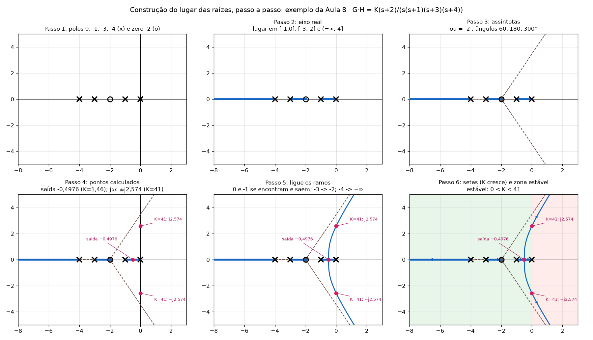
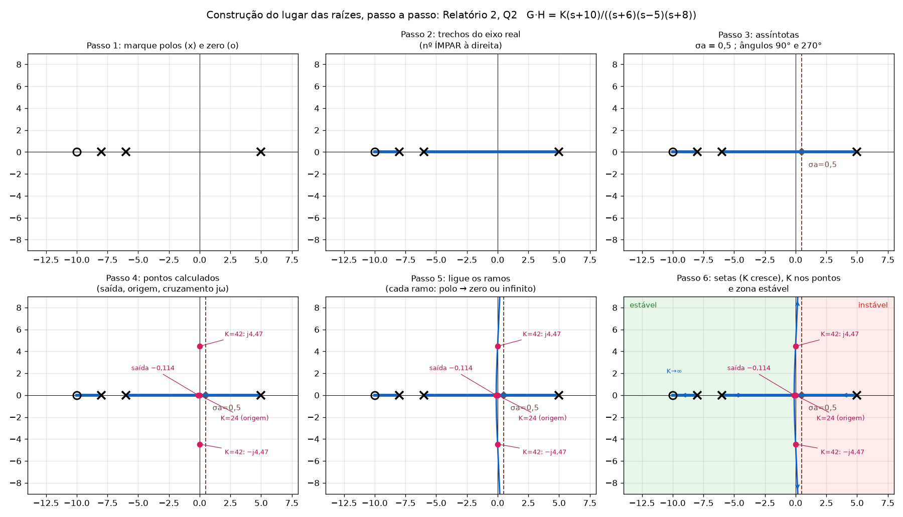
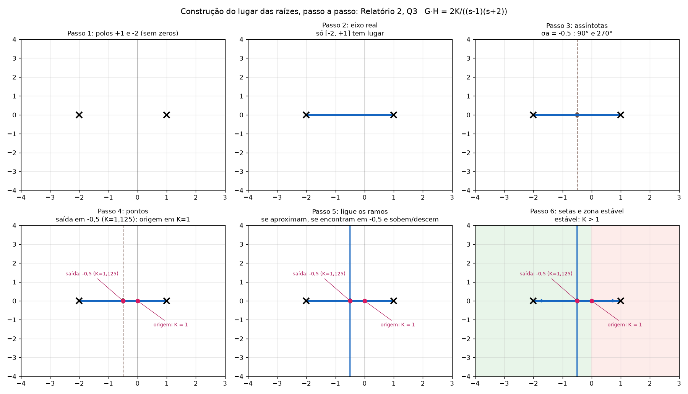
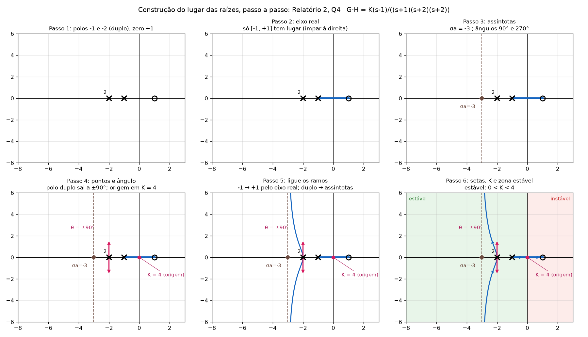
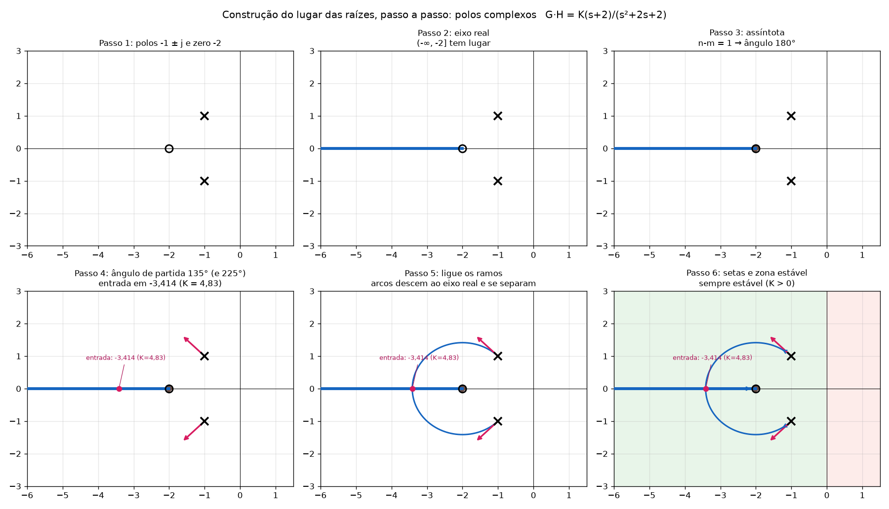
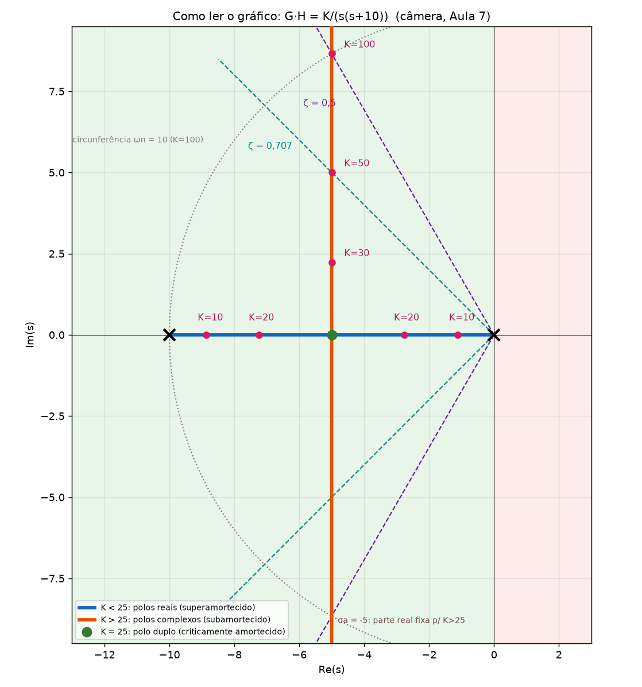
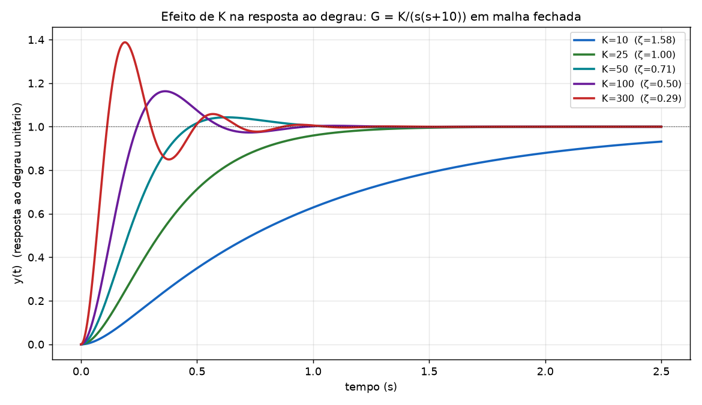

# Lugar das raízes: como desenhar a partir dos pontos e como entender o gráfico

Este arquivo tem duas partes que se complementam:

- **Parte 1: desenhar.** Você já calculou os pontos (polos, zeros, eixo real, assíntotas, ponto de saída, cruzamento com jω, ângulos). Aqui está **como transformar isso em um desenho correto**, camada por camada.
- **Parte 2: entender o gráfico.** O que cada linha, cor e ponto significa, **como ler um K, um polo, a estabilidade e o tipo de resposta**, e como responder perguntas de prova olhando o gráfico.

Pré-requisitos: os passos de cálculo estão em [Tutorial_Controle_P1.md §F](Tutorial_Controle_P1.md#f). As respostas das questões do Relatório 2 estão em [Gabarito_Relatorio2_Controle.md](Gabarito_Relatorio2_Controle.md). As figuras estão na pasta `img/`.

## Índice

**Parte 1: Desenhar**
1. [O que você precisa ter em mãos](#p1-1)
2. [Material, escala e alcance](#p1-2)
3. [Camada 1: polos e zeros](#p1-3)
4. [Camada 2: eixo real](#p1-4)
5. [Camada 3: assíntotas](#p1-5)
6. [Camada 4: pontos calculados](#p1-6)
7. [Camada 5: ligar os ramos (a parte difícil)](#p1-7)
8. [Camada 6: formato das curvas](#p1-8)
9. [Camada 7: setas, K e zona estável](#p1-9)
10. [Conferência final](#p1-10)
11. [Exemplos completos, do dado ao desenho](#p1-11)
12. [Erros de desenho e como corrigir](#p1-12)

**Parte 2: Entender o gráfico**
13. [O que o gráfico representa](#p2-1)
14. [Como ler: de K para polos e de polos para K](#p2-2)
15. [Estabilidade e faixa de K](#p2-3)
16. [Tipo de resposta pela posição dos polos](#p2-4)
17. [O que acontece quando K aumenta (exemplo completo)](#p2-5)
18. [Polos dominantes](#p2-6)
19. [Como polos e zeros deformam o desenho](#p2-7)
20. [Lendo as questões do Relatório 2](#p2-8)
21. [Perguntas de prova e como responder olhando o gráfico](#p2-9)
22. [O que o gráfico NÃO mostra](#p2-10)
23. [Usando o MATLAB para ler o gráfico](#p2-11)
24. [Exercícios de leitura com gabarito](#p2-12)

---

# PARTE 1: DESENHAR

<a id="p1-1"></a>
## 1. O que você precisa ter em mãos

Antes de pegar o lápis, confira se você tem esta lista (a mesma dos 7 passos de cálculo):

| Item | Exemplo (Q4) |
|---|---|
| Polos e zeros de malha aberta, com multiplicidade | polos −1 e −2 (duplo); zero +1 |
| `n` (nº de polos) e `m` (nº de zeros) | n = 3, m = 1 |
| Trechos do eixo real com lugar | [−1, +1] |
| Assíntotas (`σa` e ângulos) | σa = −3; 90° e 270° |
| Ponto(s) de saída/entrada válidos | nenhum fora do polo duplo |
| Cruzamento com jω (K e `±jω`) ou com a origem (K) | origem em K = 4 |
| Ângulos de partida/chegada (complexos ou polos múltiplos) | polo duplo: ±90° |

Se algum item estiver faltando, o desenho sai incompleto. Volte ao passo correspondente.

<a id="p1-2"></a>
## 2. Material, escala e alcance

1. **Mesma escala nos dois eixos** (um quadradinho = 1 unidade em x e em y). Sem isso, as assíntotas de 60° ou 45° ficam tortas e ninguém reconhece o desenho.
2. **Alcance horizontal:** do polo ou zero mais à esquerda até um pouco além do mais à direita (deixe espaço para o semiplano direito: ele mostra a região instável).
3. **Alcance vertical:** o suficiente para mostrar o **maior cruzamento com jω** e um pouco mais (se o cruzamento é em ±j4,47, vá até ±6).
4. **Gradue só onde importa:** polos, zeros, `σa`, ponto de saída e cruzamentos. Muitas marcas poluem.
5. **Use lápis nas peças auxiliares** (assíntotas, pontos) e refaça com caneta só as curvas do lugar das raízes.

<a id="p1-3"></a>
## 3. Camada 1: polos e zeros

- **Polo:** `x` (grosso). **Zero:** `o`.
- **Polo duplo:** `x` com um **"2"** ao lado.
- **Polos complexos:** dois `x`, simétricos em relação ao eixo real (`a + jb` e `a − jb`).
- **Polo ou zero no semiplano direito** (como `(s − 1)`): fica à **direita** do eixo vertical. Marque com cuidado: é onde costuma estar o erro.



<a id="p1-4"></a>
## 4. Camada 2: eixo real

Pelo passo 2 do cálculo, você sabe **quais trechos** do eixo real fazem parte do lugar (os que têm número **ímpar** de polos+zeros reais à direita).

**Como desenhar:**
1. Trace os trechos válidos com **linha grossa** (azul, se tiver cor).
2. **Não desenhe nada** nos trechos pares: eles ficam vazios.
3. Trechos que vão ao infinito (sem zero na ponta): estenda até a borda do desenho, com uma seta no fim.

**Truque para conferir:** ande da direita para a esquerda no eixo real e vá "ligando e desligando" a cada polo ou zero (contando a multiplicidade). Começa desligado; o primeiro polo/zero liga; o seguinte desliga; e assim por diante.

<a id="p1-5"></a>
## 5. Camada 3: assíntotas

Se `n > m`, há `n − m` assíntotas.

**Como desenhar com régua:**
1. Marque o ponto `σa` no eixo real (com um losango ◆).
2. A partir dele, trace retas **tracejadas** com os ângulos `θa`.
3. Estenda até a borda do desenho.

**Receita rápida para traçar o ângulo** (com a mesma escala nos dois eixos): a partir de `σa`, ande **1 unidade para a direita** e suba:

| Ângulo | Suba (para andar 1 unidade à direita) |
|---|---|
| 30° | 0,58 |
| 45° | 1 |
| 60° | 1,73 |
| 90° | reta vertical |
| 120°, 135°, 150° | espelhe: ande à **esquerda** e suba 1,73 / 1 / 0,58 |
| 180° | ao longo do eixo real para a esquerda |
| 270°, 300°... | os conjugados (espelhados para baixo) |

Os ângulos de `θa` vêm em pares simétricos (ex.: 60° e 300°). Se `n − m` for ímpar, sempre há uma assíntota de 180°, que **coincide com o eixo real**.

<a id="p1-6"></a>
## 6. Camada 4: pontos calculados

Marque com **ponto grande** (e rótulo) cada ponto que você calculou:

| Ponto | Onde marcar | O que escrever |
|---|---|---|
| Ponto de saída/entrada | no eixo real, no valor do passo 5 | `saída: −0,4976` e `K = 1,46` |
| Cruzamento com jω | no eixo imaginário, em `±jω` | `jω: ±j2,574`, `K = 41` |
| Cruzamento pela origem | na origem | `K = 4` |
| Ângulo de partida/chegada | uma **seta curta** saindo do polo (ou chegando ao zero) no ângulo calculado | `θ = 135°` |

Esses pontos são os **pontos de passagem obrigatória** da curva. Depois você só liga os pontos.

<a id="p1-7"></a>
## 7. Camada 5: ligar os ramos (a parte difícil)

**Lembrete:** um ramo é o caminho de um polo de malha fechada quando K vai de 0 a ∞. **Cada ramo nasce em um polo** e **termina em um zero ou no infinito** (pela assíntota). Se `n = 4`, há 4 ramos; se `n = 3`, 3.

### 7.1 Algoritmo para decidir o destino de cada ramo

Para **cada polo**, siga estas perguntas, na ordem:

1. **Esse polo está na ponta de um trecho válido do eixo real?**
   - **Sim.** O ramo anda ao longo desse trecho, em direção à **outra ponta**. Veja quem está lá:
     - outra ponta é um **zero**: o ramo vai **reto** até o zero e **termina**.
     - outra ponta é **outro polo**: os dois ramos andam um para o outro e **se encontram no ponto de saída**; a partir dali saem **na vertical** e sobem/descem.
     - outra ponta é o **infinito**: o ramo segue pelo eixo real até a borda do desenho (**assíntota de 180° ou 0°**).
   - **Não.** O polo é complexo, ou é duplo/múltiplo, ou não encosta em trecho válido. Vá ao item 2.
2. **O polo é complexo ou múltiplo?** O ramo **sai pelo ângulo de partida** (`θp`). Depois:
   - se o desenho tem um **ponto de entrada** no eixo real à frente, o ramo curva até lá (**arco**);
   - senão, ele **vai ao infinito** e se aproxima de uma **assíntota**.
3. **Dois ramos "se encontram" num ponto do eixo real**, então saem na vertical. **Para onde vão?** Para as **assíntotas que sobraram**: o ramo que sobe vai para a assíntota de cima, e o que desce vai para a de baixo (simetria).
4. **Ramos que chegam ao eixo real pela vertical** (ponto de entrada) separam-se: **um** vai ao zero, **o outro** ao infinito pelo eixo.

### 7.2 Tabela de situações

| Situação no desenho | Como ligar |
|---|---|
| **Polo → zero** (trecho válido entre eles) | Reto pelo eixo real, termina no zero. Ex.: Aula 8, polo −3 → zero −2. |
| **Polo → infinito**, pelo eixo real | Reto pelo eixo real até a borda. Ex.: Aula 8, polo −4 → −∞. |
| **Polo ↔ polo** (trecho válido entre eles) | Um vai ao encontro do outro; encontram-se no ponto de saída e **saem a ±90°**. Ex.: Aula 8, polos 0 e −1; **Q3**, polos +1 e −2. |
| **Zero ↔ zero** (trecho válido entre eles) | Ramos vêm de cima/baixo e **entram** no eixo a 90°. |
| **Polo complexo** | Sai em `θp`, forma um arco e **desce** ao ponto de entrada (ou segue à assíntota). Ex.: `K(s+2)/(s²+2s+2)`. |
| **Polo duplo** | Os dois ramos saem **na vertical** (ou no ângulo calculado) do polo e se afastam. Ex.: **Q4**, polo −2. |
| **Zero no semiplano direito** | Um ramo termina nele (ex.: Q4: −1 → +1). |
| **Polo no semiplano direito** | Parte dele e caminha para a esquerda pelo trecho válido (ex.: Q3: +1 → 0 → −0,5). |

### 7.3 Contagem final (confira os números)

- Nº de ramos desenhados = `n`.
- Ramos que terminam em zeros = `m`.
- Ramos que vão ao infinito = `n − m` (e há `n − m` assíntotas).
- Cada trecho válido do eixo real é percorrido por ramos (um ou dois).
- Nenhum ramo cruza outro, exceto nos pontos de saída/entrada.

<a id="p1-8"></a>
## 8. Camada 6: formato das curvas

Agora trace as curvas com caneta, seguindo estas regras de forma:

1. **Comece e termine nos pontos conhecidos** (polos, pontos de saída, cruzamentos, assíntotas).
2. **No ponto de saída/entrada:** a curva é **perpendicular** ao eixo real.
3. **No polo complexo:** a curva sai exatamente no ângulo `θp` que você calculou.
4. **Entre pontos:** a curva é **suave** (sem cantos nem "bicos").
5. **Longe da origem:** a curva **se aproxima da assíntota**, sem tocá-la no infinito. Na prática, ela fica **ao lado** da assíntota, do mesmo lado de onde veio.
6. **Cruzamento com jω:** a curva atravessa o eixo imaginário no ponto marcado, **inclinada** (não precisa ser perpendicular).
7. **Simetria:** desenhe a metade de cima e **espelhe** a de baixo em relação ao eixo real.
8. **Ramos nunca se tocam nem se cruzam**, exceto no ponto de saída/entrada.
9. **Curvatura:** ramos que saem de um ponto no eixo real e vão para uma assíntota fazem um "C" aberto (como um parêntese). Se a assíntota está à esquerda do ponto de saída, o ramo se curva para a esquerda; se está à direita, para a direita.

<a id="p1-9"></a>
## 9. Camada 7: setas, K e zona estável

1. **Setas** em cada ramo, no sentido em que **K cresce** (do polo em direção ao zero ou ao infinito).
2. **Escreva K** nos pontos notáveis: `K = 0` nos polos, `K = 1,46` no ponto de saída, `K = 41` no cruzamento com jω.
3. **Sombreie** (ou escreva "estável") o **semiplano esquerdo** (tudo à esquerda do eixo vertical). A zona à direita é a **instável**.
4. **Indique a faixa de K estável** num canto: `estável: 0 < K < 41`.
5. **Título** com a função `G·H`.

<a id="p1-10"></a>
## 10. Conferência final

| Conferência | Como verificar |
|---|---|
| Ramos | contei `n` ramos? |
| Zeros | `m` ramos terminam em zeros? |
| Infinito | `n − m` ramos seguem assíntotas? |
| Eixo real | só os trechos ímpares estão desenhados? |
| Simetria | a metade de cima é o espelho da de baixo? |
| Assíntotas | `σa` e ângulos corretos, com mesma escala nos eixos? |
| Pontos | ponto de saída **dentro** de trecho válido; cruzamento com jω **bate com o Routh**? |
| Soma dos polos (se `n − m ≥ 2`) | a soma dos polos de malha fechada **não muda** com K; confira em um K qualquer |
| Ponto de teste | pegue um ponto qualquer da curva e use a **condição de fase** (soma de ângulos = ±180°) |
| MATLAB | `rlocus(G*H)` deve ter o mesmo formato |

<a id="p1-11"></a>
## 11. Exemplos completos, do dado ao desenho

Cada exemplo mostra as figuras de construção (6 painéis: peças → ligação → leitura).

### 11.1 Aula 8: `K(s+2)/(s(s+1)(s+3)(s+4))`


| Dado | Desenho |
|---|---|
| polos 0, −1, −3, −4; zero −2 | cinco marcas no eixo real |
| eixo real: [−1,0], [−3,−2], (−∞,−4] | linha grossa nesses 3 trechos |
| `σa = −2`; 60°, 180°, 300° | duas retas tracejadas a partir de −2, uma a 60° e outra a 300°; a de 180° coincide com o eixo real |
| saída −0,4976 (K = 1,46) | ponto no eixo, entre 0 e −1 |
| jω: ±j2,574 (K = 41) | pontos no eixo imaginário |
| **Ligar:** polos 0 e −1 se encontram em −0,4976 e saem na vertical; polo −3 → zero −2; polo −4 → −∞ | |
| **Formato:** os ramos que saíram do eixo curvam-se **para a direita**, atravessam jω em ±j2,574 e seguem as assíntotas de 60° e 300° | |
| Estável: 0 < K < 41 | semiplano esquerdo sombreado |

### 11.2 Relatório 2 Q2: `K(s+10)/((s+6)(s−5)(s+8))`



| Dado | Desenho |
|---|---|
| polos −8, −6, **+5**; zero −10 | `x` em −8, −6, +5; `o` em −10 |
| eixo real: [−6,+5] e [−10,−8] | linhas grossas |
| `σa = +0,5`; 90° e 270° | reta vertical tracejada **no semiplano direito**, em +0,5 |
| saída −0,114 (K ≈ 24,01); origem em K = 24; jω ±j4,47 (K = 42) | pontos |
| **Ligar:** polo +5 anda para a **esquerda**, polo −6 para a **direita**; encontram-se em −0,114; polo −8 → zero −10 | |
| **Formato:** os ramos saem na vertical em −0,114, sobem/descem **quase retos** (a assíntota é vertical em +0,5), atravessam jω em ±j4,47 e acabam no semiplano direito | |
| Estável: 24 < K < 42 | o trecho entre K = 24 (origem) e K = 42 (jω) |

Dica visual: como as curvas são quase verticais e muito próximas do eixo jω, faça um **zoom** perto da origem (veja o inset em [img/rl_q2.png](img/rl_q2.png)).

### 11.3 Relatório 2 Q3: `2K/((s−1)(s+2))`



| Dado | Desenho |
|---|---|
| polos +1, −2; sem zeros | dois `x` |
| eixo real: [−2, +1] | linha grossa |
| `σa = −0,5`; 90° e 270° | reta vertical em −0,5 |
| saída −0,5 (K = 1,125); origem K = 1 | pontos |
| **Ligar:** polo +1 anda para a esquerda, passa pela origem (K = 1) e encontra o polo −2, que anda para a direita, em −0,5 | |
| **Formato:** a partir de −0,5 os dois ramos sobem/descem **exatamente sobre a assíntota** (a reta vertical em −0,5 **é** o lugar) | |
| Estável: K > 1 | o semiplano esquerdo a partir de K = 1 |

### 11.4 Relatório 2 Q4: `K(s−1)/((s+1)(s+2)(s+2))`



| Dado | Desenho |
|---|---|
| polos −1 e −2 (duplo), zero **+1** | `x` em −1, `x` duplo em −2, `o` em +1 |
| eixo real: [−1, +1] | linha grossa |
| `σa = −3`; 90° e 270° | reta vertical em −3 |
| origem em K = 4; polo duplo sai a ±90° | ponto na origem; setas verticais em −2 |
| **Ligar:** polo −1 → zero +1 pelo eixo real (passando pela origem em K = 4); polo duplo −2 → dois ramos saem na vertical e curvam **para a esquerda** (rumo à assíntota em −3) | |
| Estável: 0 < K < 4 | |

### 11.5 Polos complexos: `K(s+2)/(s²+2s+2)` (Aula 8)



| Dado | Desenho |
|---|---|
| polos −1 ± j; zero −2 | dois `x` acima e abaixo do eixo; `o` em −2 |
| eixo real: (−∞, −2] | linha grossa para a esquerda do zero |
| `n − m = 1`: assíntota de 180° | coincide com o eixo real |
| `θp = 135°` (em −1 + j) e 225° (em −1 − j) | setas saindo dos polos |
| entrada em −3,414 (K = 4,83) | ponto no eixo real à esquerda do zero |
| **Ligar:** dos polos complexos saem arcos que **descem ao eixo real** em −3,414; lá um ramo vai ao zero em −2 e o outro a −∞ | |
| Sempre estável (K > 0) | |

<a id="p1-12"></a>
## 12. Erros de desenho e como corrigir

| Erro | Sintoma | Correção |
|---|---|---|
| Escalas diferentes em x e y | assíntotas com ângulos estranhos | refaça com quadriculado de mesma escala |
| Lugar em trecho par do eixo real | linha grossa onde não devia | recontar polos/zeros à direita |
| Ramo cruza outro ramo fora de um ponto de saída | desenho confuso | no lugar das raízes, ramos não se cruzam |
| Metade do desenho (sem simetria) | só um dos conjugados | espelhe pelo eixo real |
| Assíntota saindo da origem | `σa` esquecido | a assíntota parte de `σa`, não de 0 |
| Esqueceu `K` nos pontos / faixa estável | desenho "mudo" | rotule os pontos notáveis |
| Ponto de saída fora do lugar | raiz de `A'B−AB'` em trecho par | descarte a raiz |
| Ramo "para" no meio | não terminou em zero nem no infinito | todo ramo termina em zero ou assíntota |
| Setas no sentido contrário | K parece diminuir | setas vão do polo ao zero/infinito |

---

# PARTE 2: ENTENDER O GRÁFICO

<a id="p2-1"></a>
## 13. O que o gráfico representa

Pense em um sistema com um **botão de ganho K** que você pode girar de 0 a infinito. Para cada posição do botão, o sistema em malha fechada tem **polos**: pontos no plano s. O lugar das raízes é o **registro de todas as posições** desses polos enquanto você gira o botão.

| Elemento | Significado |
|---|---|
| **Eixo horizontal** | parte real `σ` do polo: **decaimento/crescimento** da resposta |
| **Eixo vertical** | parte imaginária `ω`: **frequência de oscilação** |
| **`x`** | polos de malha aberta: onde os polos de malha fechada estão em **K = 0** |
| **`o`** | zeros de malha aberta: para onde os polos tendem em **K → ∞** |
| **Linha azul (ramo)** | trajetória de um polo de malha fechada quando K cresce |
| **Linha verde grossa** | trecho em que **todos** os polos estão no semiplano esquerdo (sistema estável) |
| **Setas** | sentido de K crescendo |
| **Fundo verde / vermelho** | semiplano esquerdo (estável) / direito (instável) |
| **Pontos rosa** | pontos calculados (saída, cruzamentos), com seu K |
| **Retas tracejadas marrons** | assíntotas (para onde os ramos tendem no infinito) |

**Cada ponto do gráfico, para um K específico, é um polo.** Se o sistema tem 3 polos, para cada K há **3 pontos** (um por ramo), ao mesmo tempo.

<a id="p2-2"></a>
## 14. Como ler: de K para polos e de polos para K

### 14.1 Dado K, onde estão os polos?

1. Escolha um K.
2. Em cada ramo, ache o ponto que corresponde a esse K (as marcações de K nos pontos notáveis ajudam a se orientar: o ramo está "antes" ou "depois" desses pontos).
3. Esses pontos são os polos de malha fechada **para esse K**.
4. **Conferência exata:** raízes de `A(s) + K·B(s) = 0` (no MATLAB: `pole(feedback(K*G*H,1))`).

Exemplo (câmera, `K/(s(s+10))`): os polos são `s = −5 ± √(25 − K)`.

| K | Polos | Onde estão no gráfico |
|---|---|---|
| 10 | −1,127 e −8,873 | dois pontos no eixo real, simétricos em torno de −5 |
| 25 | −5 e −5 | encontro (ponto de saída) |
| 100 | −5 ± j8,66 | na vertical em −5, bem acima e abaixo |

### 14.2 Dado um polo (ponto do gráfico), qual é o K?

Use a **condição de ganho**: `K = 1/|G·H(s)|` = (produto das distâncias aos polos de malha aberta)/(produto das distâncias aos zeros).

Exemplo: polo desejado `s₀ = −5 + j8,66` em `K/(s(s+10))`.
- distância de `s₀` até o polo em 0: `√(25 + 75) = 10`
- distância de `s₀` até o polo em −10: `√(25 + 75) = 10`
- `K = 10 × 10 = 100` ✓ (sem zeros no denominador da fração).

**Quando o ponto está de fato no lugar?** Só se a **condição de fase** for satisfeita: soma dos ângulos dos zeros menos soma dos ângulos dos polos, até o ponto, igual a `±180°`. Se der outro valor, o ponto **não** está no lugar (nenhum K o produz).

<a id="p2-3"></a>
## 15. Estabilidade e faixa de K

**Regra:** o sistema é estável para um K se **todos** os polos (um por ramo) estão no semiplano esquerdo ([Resumo sobre estabilidade](Tutorial_Controle_P1.md#e)). Lembre por que: um polo `σ + jω` contribui com `e^(σt)`, que decai se `σ < 0` e explode se `σ > 0`.

**Como achar a faixa de K no gráfico:**

1. **Em K pequeno** (início dos ramos): veja se algum polo (`x`) está no semiplano direito. Se estiver, o sistema começa **instável**.
2. **Ao longo dos ramos:** marque os pontos em que um ramo **cruza o eixo vertical** (ou passa pela origem). Cada cruzamento é uma **fronteira** de estabilidade.
3. **Em cada fronteira**, leia o K (calculado pelo Routh).
4. **Estável** é o intervalo de K em que **nenhum** ramo está à direita.

| Questão | Leitura do gráfico | Faixa |
|---|---|---|
| **Q2** | em K = 0 há o polo +5 (instável). Ele chega à origem em K = 24. Em K = 42 o par de ramos cruza jω e vai ao semiplano direito. | **24 < K < 42** |
| **Q3** | em K = 0 há o polo +1 (instável). Ele cruza a origem em K = 1. Depois, os dois ramos ficam em Re = −0,5, no semiplano esquerdo. | **K > 1** |
| **Q4** | em K = 0 todos os polos estão à esquerda. O ramo que vai ao zero em +1 cruza a origem em K = 4. | **0 < K < 4** |
| **Aula 8** | em K = 0 há um polo em 0 (marginal). Para K > 0 todos à esquerda até K = 41, quando o par cruza jω em ±j2,574. | **0 < K < 41** |

**Por que "verde" mostra a faixa estável:** na figura, o verde grosso destaca os pedaços de cada ramo que correspondem **ao mesmo intervalo de K** em que **todos** os ramos estão no semiplano esquerdo.

<a id="p2-4"></a>
## 16. Tipo de resposta pela posição dos polos

A posição do polo no plano diz **como a resposta se comporta**. Para um par de polos complexos `−σ ± jωd`:

| Grandeza | Onde ler no gráfico | Fórmula |
|---|---|---|
| **Frequência natural ωn** | distância do polo à **origem** | `ωn = √(σ² + ωd²)` |
| **Amortecimento ζ** | **ângulo** que a reta origem→polo faz com o eixo real negativo | `ζ = cos φ = σ/ωn` |
| **Velocidade de decaimento** | distância do polo ao **eixo vertical** (`σ`) | `ts(2%) = 4/σ` |
| **Frequência de oscilação ωd** | altura do polo (parte imaginária) | `tp = π/ωd` |
| **Overshoot** | só depende de ζ (do ângulo) | `Mp = e^(−πζ/√(1−ζ²))` |

### Mapa geométrico

- **Circunferências centradas na origem** = ωn constante.
- **Retas pela origem** = ζ constante (quanto mais próximas do eixo vertical, menor ζ; quanto mais próximas do eixo real, maior ζ).
- **Retas verticais** = `σ` constante, isto é, **ts constante**.
- **Retas horizontais** = ωd constante, ou seja, **tp constante**.

### Classificação pela posição

| Onde estão os polos | Tipo de resposta |
|---|---|
| Dois polos **reais e distintos** | superamortecido (ζ > 1), sem oscilar |
| Dois polos reais **iguais** (ponto de saída) | criticamente amortecido (ζ = 1) |
| **Complexos** conjugados no semiplano esquerdo | subamortecido (0 < ζ < 1): oscila e decai |
| Sobre o **eixo vertical** (`±jω`) | oscilação sem amortecimento (ζ = 0, marginal) |
| No **semiplano direito** | instável: cresce |

Figura: câmera `K/(s(s+10))` com K em vários pontos, retas de ζ = 0,5 e 0,707 e a circunferência ωn = 10:



<a id="p2-5"></a>
## 17. O que acontece quando K aumenta (exemplo completo)

Sistema `G = K/(s(s+10))` em malha fechada: `T = K/(s² + 10s + K)`, `ωn = √K`, `ζ = 5/√K`.

| K | Polos | ζ | ωn | Mp | ts (2 %) | Resposta |
|---|---|---|---|---|---|---|
| 10 | −8,87 e −1,13 | 1,58 | 3,16 | 0 | ≈ 3,5 s (polo lento) | superamortecido, lenta |
| 20 | −7,24 e −2,76 | 1,12 | 4,47 | 0 | ≈ 1,4 s | superamortecido |
| **25** | **−5 (duplo)** | **1** | 5 | 0 | ≈ 1,2 s | **criticamente amortecido** |
| 30 | −5 ± j2,24 | 0,91 | 5,48 | 0,1 % | 0,80 s | subamortecido, quase sem overshoot |
| 50 | −5 ± j5 | 0,71 | 7,07 | 4,3 % | 0,80 s | subamortecido |
| 100 | −5 ± j8,66 | 0,50 | 10 | 16,3 % | 0,80 s | subamortecido |
| 300 | −5 ± j16,6 | 0,29 | 17,3 | 38,8 % | 0,80 s | muito oscilatório |



**O que este exemplo ensina (aplicável a qualquer lugar das raízes):**

1. **Até K = 25:** os polos andam sobre o eixo real, um para a esquerda, outro para a direita, em direção um ao outro. Resposta **sem oscilação**; o polo mais próximo da origem (o lento) **limita a rapidez**.
2. **Em K = 25:** polo duplo, resposta mais rápida **sem overshoot**.
3. **Acima de K = 25:** polos complexos. A parte real fica **fixa em −5** (a assíntota vertical), então **o tempo de acomodação não muda** (0,80 s), mas a parte imaginária cresce, então o **overshoot aumenta** e a resposta fica mais oscilatória.
4. **Aumentar K não é "sempre melhor":** rapidez de subida aumenta, mas a oscilação também. É o compromisso entre ζ (overshoot) e ωn (rapidez) que o professor menciona (Aula 2: aceitável 0,4 < ζ < 0,7).
5. **Neste sistema o K é sempre estável** (os polos nunca passam para a direita): por isso o lugar não cruza jω.

<a id="p2-6"></a>
## 18. Polos dominantes

Quando há **mais de dois polos**, nem todos importam igualmente. Os **dominantes** são os **mais próximos do eixo vertical** (menor `|σ|`): eles decaem **mais devagar**, então comandam a resposta. Os outros decaem rápido e "somem" cedo.

- Regra prática: um polo com `|σ|` **5 vezes maior** que o do dominante afeta pouco a resposta.
- Em ordem alta (como a Aula 8, com 4 polos), olhe primeiro **o par mais perto do eixo jω** e use as fórmulas de 2ª ordem (ζ, ωn, Mp, ts) sobre ele.

**Exemplo (Q2, K = 30):** os polos são −8,86 e **−0,07 ± j2,60**. O par complexo, com `σ = −0,07`, é o dominante, e é **muito pouco amortecido** (está quase em cima do eixo jω): ζ ≈ 0,03, `ts ≈ 4/0,07 ≈ 58 s`. O polo −8,86 é rápido e irrelevante. Mesmo estável, o sistema oscila por muito tempo. Na Q2 isso vale para **qualquer K da faixa estável**: o par complexo nunca passa de `σ ≈ −0,114` (o melhor caso é logo depois do ponto de saída, K ≈ 24,02), então `ts ≥ 4/0,114 ≈ 35 s`. O desenho mostra isso: os ramos ficam colados no eixo jω.

<a id="p2-7"></a>
## 19. Como polos e zeros deformam o desenho

| Mudança | Efeito no lugar das raízes |
|---|---|
| **Adicionar um polo** | puxa os ramos **para a direita** (tende a piorar a estabilidade; pode criar cruzamento com jω) |
| **Adicionar um zero** | puxa os ramos **para a esquerda** (tende a melhorar a estabilidade e a rapidez) |
| **Polo no semiplano direito** | o sistema começa instável: exige K mínimo |
| **Zero no semiplano direito** | um ramo termina no semiplano direito: exige K máximo (Q4) |
| **Polos adjacentes e próximos** | juntam-se no ponto de saída, tornando a resposta complexa depois |
| **n − m maior** | mais ramos no infinito, assíntotas mais inclinadas, mais difícil manter estável com K grande (n − m ≥ 3: sempre instável para K grande) |

<a id="p2-8"></a>
## 20. Lendo as questões do Relatório 2

### Q2: `K(s+10)/((s+6)(s−5)(s+8))`

- **Polo +5** no semiplano direito: com K baixo o sistema é **instável**; precisa de K > 24 para o ramo +5 chegar ao semiplano esquerdo (passando pela origem).
- Em K = 24,01 os dois ramos (de +5 e de −6) se encontram em −0,114 e **saem do eixo real**.
- Entre K = 24 e 42: **estável**, mas com par complexo **muito perto do eixo jω** (pouco amortecido, oscila muito).
- K > 42: o par cruza jω e fica **instável**.
- O ramo de −8 vai ao zero −10: **polo rápido** que não limita.

### Q3: `2K/((s−1)(s+2))`

- Polo **+1** instável: precisa de K > 1.
- Em K = 1,125 os ramos se encontram em −0,5 e sobem na **vertical**.
- Para K > 1,125: polos `−0,5 ± j√(2K − 2,25)`. A parte real fica fixa em −0,5: **ts = 4/0,5 = 8 s** (lento), e o overshoot cresce com K (K = 3: ζ = 0,25, Mp ≈ 44 %).
- Estável **para qualquer K > 1**.

### Q4: `K(s−1)/((s+1)(s+2)(s+2))`

- Zero **+1** no semiplano direito: **limita K** (K < 4).
- Em K = 4 um polo chega à origem: limite de estabilidade.
- Polos complexos (saindo do duplo −2) ficam sempre à esquerda; o polo que vai ao zero +1 (partindo de −1) é o único que atravessa para a direita.
- Para K pequeno, o polo real perto da origem é o **dominante** (lento).

<a id="p2-9"></a>
## 21. Perguntas de prova e como responder olhando o gráfico

| Pergunta | Como responder |
|---|---|
| "Para que K o sistema é estável?" | Veja onde os ramos estão no semiplano esquerdo; a faixa vem dos cruzamentos de jω (Routh). |
| "Existe K para o qual o sistema oscila sem amortecimento?" | Sim, se algum ramo **cruza o eixo jω**. O K é o do cruzamento e a frequência é `ω` desse ponto. |
| "Para que K a resposta é criticamente amortecida?" | K do **ponto de saída** (polos reais iguais). |
| "Para que K não há oscilação?" | Enquanto os polos dominantes forem reais: antes do ponto de saída. |
| "Qual é o overshoot para K = ...?" | Ache os polos complexos para esse K, calcule `ζ = σ/ωn` e `Mp`. |
| "O que acontece se aumentar K?" | Siga os ramos: veja se os polos complexos se afastam do eixo real (mais oscilação), se cruzam jω (instabilidade) ou se `σ` fica fixo (ts constante). |
| "Qual é o tempo de acomodação aproximado?" | `ts = 4/|σ|` do polo dominante (2 %). |
| "O sistema é estável para qualquer K?" | Não, se algum ramo vai ao semiplano direito (n−m ≥ 3, ou RHP polo/zero). Sim, se todos ficam à esquerda para todo K > 0 (ex.: polos complexos da Aula 8). |
| "Qual K dá ζ = 0,5?" | Traça a reta de ζ = 0,5 (60° do eixo real negativo), acha onde cruza o lugar, calcula K nesse ponto. |
| "Como o K afeta o erro estacionário?" | Não está no gráfico; use `Kp`, `Kv` ou `Ka` (aumentar K reduz o erro finito). |

<a id="p2-10"></a>
## 22. O que o gráfico NÃO mostra

- **Os zeros de malha fechada** (que moldam a resposta, mas não afetam a estabilidade).
- **Erro em regime permanente** (depende de `Kp`, `Kv`, `Ka`; não está no gráfico).
- **A amplitude da resposta** (o ganho DC de malha fechada).
- **Atrasos, saturação, ruído**: o modelo é linear.
- **Estabilidade se algum ramo tem polo e zero muito próximos** pode ter cancelamentos que o desenho esconde (um polo "quase cancelado" contribui pouco).
- **Várias combinações de ganho**: só variamos **um** parâmetro (K). Para variar outro (ex.: um polo do controlador), é um novo lugar das raízes.

<a id="p2-11"></a>
## 23. Usando o MATLAB para ler o gráfico

Depois de `rlocus(A)`:

1. **Clique em qualquer ponto da curva.** Aparece uma etiqueta com: **Gain (K)**, **Pole**, **Damping (ζ)**, **Overshoot (%)**, **Frequency (rad/s)** (ωn) e o sistema. É a leitura direta do que você calculou.
2. **`sgrid`** desenha as retas de ζ e as circunferências de ωn sobre o gráfico (ajuda a visualizar o mapa da seção 16).
3. **`[K,polos] = rlocfind(A)`:** clique em um ponto e o MATLAB devolve o K e os polos correspondentes.
4. **Zoom:** troque `axis([...])`.
5. **Conferir uma faixa:** `pole(feedback(K*A,1))` para um K dentro e outro fora.
6. **Resposta ao degrau para um K:** `step(feedback(K*A,1))`.

Código base no formato do professor (veja os de cada questão em [Gabarito_Relatorio2_Controle.md](Gabarito_Relatorio2_Controle.md)):

```matlab
clear all
clc
G=tf(1,[1 10 0])     %F.T. Ramo direto: 1/(s(s+10)).
H=tf([1],[1])        %F.T. Ramo feedback.
A=G*H                %F.T. Malha aberta.
rlocus(A)            %Root Locus.
axis([-13 3 -9.5 9.5])
sgrid                %retas de zeta e circunferencias de wn
```

<a id="p2-12"></a>
## 24. Exercícios de leitura com gabarito

**Ex. 1. (Q3) Para K = 3, onde estão os polos e como é a resposta?**
- Polos: `s = −0,5 ± ½√(9 − 24) = −0,5 ± j1,94`.
- `ωn = √(0,25 + 3,75) = 2`, `ζ = 0,5/2 = 0,25`.
- `Mp = e^(−π·0,25/√(1 − 0,0625)) ≈ 44 %`; `ts = 4/0,5 = 8 s`.
- A resposta é muito oscilatória e lenta para acalmar. (A fórmula de Mp vale para o formato da resposta; o valor final não é 1 porque o numerador é `2K = 6`, não `ωn² = 4`.)

**Ex. 2. (Q2) Para K = 30, o sistema é estável? Que polos tem?**
- 24 < 30 < 42 → estável.
- Polos: −8,86 e −0,07 ± j2,60. O par complexo tem `ζ ≈ 0,03`: **pouco amortecido** (quase oscilatório), `ts ≈ 58 s`.
- Conclusão: estável, mas inadequado. Para K em toda a faixa (24 < K < 42), `|σ|` do par complexo fica entre 0 e 0,114, então o sistema **é sempre muito pouco amortecido**. Subir K (ex.: 35) só piora (`σ = −0,04`), e o melhor caso é K ≈ 24,02 (`σ = −0,114`, mas com `ωd` pequeno, resposta lenta).

**Ex. 3. (Q4) Para K = 1, quais são os polos e qual domina?**
- Polos: −0,43 (real) e −2,29 ± j1,35.
- O polo real em −0,43 é o **dominante** (o mais perto do eixo jω): resposta lenta, `ts ≈ 4/0,43 ≈ 9,4 s`, sem oscilação marcante. O par complexo decai rápido.

**Ex. 4. (Aula 8) O sistema pode oscilar sem amortecimento? Em que K e frequência?**
- Sim: o lugar cruza jω em **K = 41**, `s = ±j2,574`. Para esse K, a oscilação tem `ω = 2,574 rad/s` (período `2π/2,574 ≈ 2,4 s`) e não decai. Para K > 41, o sistema é instável.

**Ex. 5. (Câmera) Qual K dá criticamente amortecido? E ζ = 0,707?**
- Criticamente amortecido: polo duplo em −5 → `K = 25`.
- ζ = 0,707: `ζ = 5/√K = 0,707` → `√K = 7,07` → `K = 50` (polos −5 ± j5, na reta de 45°).

Se quiser praticar mais, pegue qualquer K de uma das questões, calcule os polos com `roots([...])` e responda: estável? dominante? ζ, Mp, ts? Compare com o gráfico do MATLAB.
