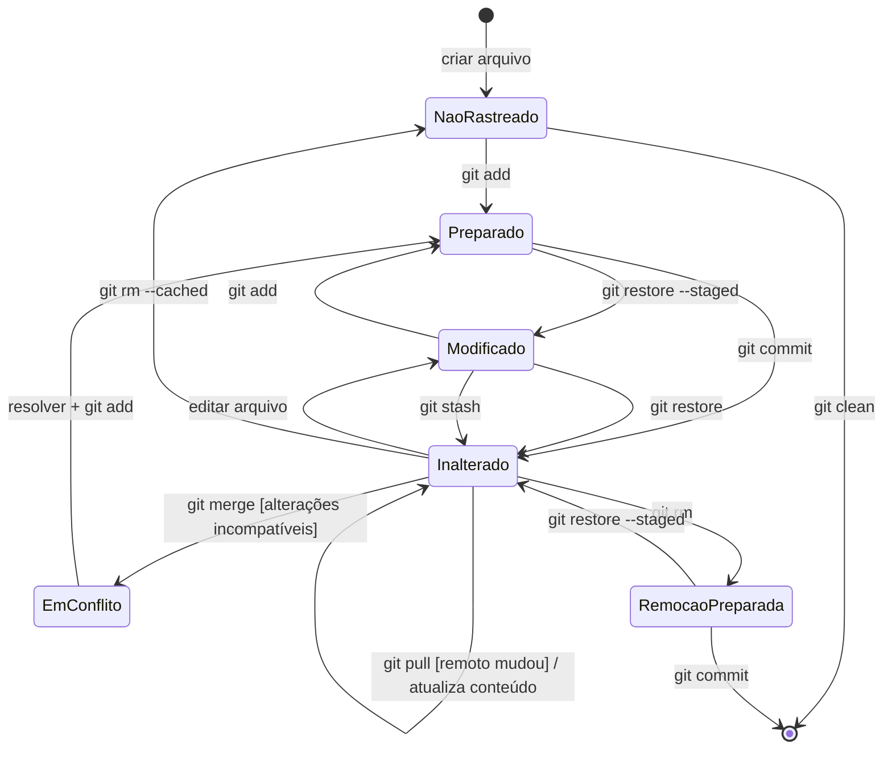

# Gabarito – Exercícios da P1

Cobre `Exercícios/exercicios_asm.pdf` (17 questões), `exercicio_primos.pdf` e `Exercício de MEF.txt`.

- Todas as respostas usam **assembly Thumb-2 (Keil armasm)**, conforme a Tabela da prova.
- Cada questão termina com **"Estudar:"**: links para o [Resumo_P1.md](Resumo_P1.md). Se errou a questão, leia esses trechos.
- **[Tabela p.N]** = página do `QRC0001_UAL.pdf`. Ver mapa em [Resumo §0.2](Resumo_P1.md#s0-2).
- Convenção: x = R1, y = R2, z = R3, resultado em R0, e **R12 como rascunho** (AAPCS: R0-R3 e R12 podem ser destruídos, [Resumo §10](Resumo_P1.md#s10)).
- Onde o enunciado pede "menor número de instruções", indico a contagem. Pode haver outras soluções com o mesmo tamanho.

## Índice

[Ex.1](#ex1) · [2](#ex2) · [3](#ex3) · [4](#ex4) · [5](#ex5) · [6](#ex6) · [7](#ex7) · [8](#ex8) · [9](#ex9) · [10](#ex10) · [11](#ex11) · [12](#ex12) · [13](#ex13) · [14](#ex14) · [15](#ex15) · [16](#ex16) · [17](#ex17) · [Primos](#primos) · [MEF (git)](#mef)

---

<a id="ex1"></a>
## Questão 1 – Endereços de words consecutivos

100 words de 32 bits (4 bytes) a partir de **0x00420A0**. A word de posição *n* (1ª = posição 1) fica em `base + 4 × (n − 1)`.

- **7º espaço:** 0x00420A0 + 4×6 = 0x00420A0 + 0x18 = **0x00420B8**
- **22º espaço:** 0x00420A0 + 4×21 = 0x00420A0 + 0x54 = **0x00420F4**

**Estudar:** word = 32 bits, endereço do byte menos significativo ([Resumo §8.1](Resumo_P1.md#s8)); vetor de words ([§9.5](Resumo_P1.md#s9-5)).

---

<a id="ex2"></a>
## Questão 2 – Equações

x = R1, y = R2, z = R3, resultado em R0. **[Tabela p.1 (ADD/SUB/RSB) e p.2 (MUL, shifts)]**

**a) x + y + z** (2)
```
        ADD   R0, R1, R2
        ADD   R0, R0, R3
```

**b) y − x − z** (2)
```
        SUB   R0, R2, R1        ; y - x
        SUB   R0, R0, R3        ; - z
```

**c) 2x + 2y + 2z = 2(x+y+z)** (3)
```
        ADD   R0, R1, R2
        ADD   R0, R0, R3
        LSL   R0, R0, #1        ; ×2 (fatorar o 2 evita 3 shifts)
```

**d) 5(x + y)** (2)
```
        ADD   R0, R1, R2
        ADD   R0, R0, R0, LSL #2   ; R0 + 4·R0 = 5·R0 (shift dentro do Operand2)
```

**e) (x + y)(y − z)** (3)
```
        ADD   R0, R1, R2        ; x + y
        SUB   R12, R2, R3       ; y - z (R12 = rascunho, não destrói x, y, z)
        MUL   R0, R0, R12
```

**f) 3 − 5x − 16·y³·z³** (6). Fatoração: 16·y³z³ = 16·(yz)³.
```
        MUL   R0, R2, R3           ; t = y·z
        MUL   R12, R0, R0          ; t²
        MUL   R0, R12, R0          ; t³
        ADD   R12, R1, R1, LSL #2  ; 5x
        RSB   R12, R12, #3         ; 3 - 5x
        SUB   R0, R12, R0, LSL #4  ; (3 - 5x) - 16·t³   (LSL #4 = ×16 no Operand2)
```

**Estudar:** Operand2 com shift e truques de multiplicação ([Resumo §9.2](Resumo_P1.md#s9-2)); `RSB` para "constante − variável"; `MUL/MLA/MLS` (Tabela p.2).

---

<a id="ex3"></a>
## Questão 3 – Pseudocódigo → assembly (x = R1, y = R2)

Como não pode saltar em (a), (b) e (c), usa-se **`IT`** com sufixo de condição **[Tabela p.3 (IT) e p.6 (Condition Field)]**.

**a) `if (x == 0) x = x + 3;`** (3 linhas)
```
        CMP     R1, #0
        IT      EQ
        ADDEQ   R1, R1, #3
```

**b) `if (x >= 5) x = 0;`** (x com sinal → **GE**)
```
        CMP     R1, #5
        IT      GE
        MOVGE   R1, #0
```

**c) `x = 10; y = 5; while (x > 0) { y = y*x; x = x-1; }`**

Sem instruções de salto o laço não pode existir; como os valores iniciais são constantes, o resultado é conhecido: y = 5 × 10! = 5 × 3.628.800 = **18.144.000 = 0x0114DB00** e x termina em 0.
```
        MOVW    R2, #0xDB00          ; y (parte baixa)
        MOVT    R2, #0x0114          ; y (parte alta) = 0x0114DB00
        MOV     R1, #0               ; x = 0 ao final
```
Se o professor aceitar desvio (versão "natural" com laço):
```
        MOV     R1, #10
        MOV     R2, #5
loop    MUL     R2, R2, R1           ; y = y * x
        SUBS    R1, R1, #1           ; x = x - 1, atualiza flags
        BGT     loop                 ; enquanto x > 0 (com sinal)
```
Alternativa sem salto e sem constante pronta: desenrolar (10 `MUL` seguidos com R1 recarregado).

**d) `if (x < 9) x = x + 1; else x = 0;`**
```
        CMP     R1, #9
        ITE     LT
        ADDLT   R1, R1, #1           ; então
        MOVGE   R1, #0               ; senão (inverso de LT é GE)
```

**e) `if (x > 9) { x = 0; if (y > 9) y = 0; else y = y + 1; } else x = x + 1;`**
```
        CMP     R1, #9
        BLE     x_inc                ; x <= 9 -> ramo senão
        MOV     R1, #0               ; x = 0
        CMP     R2, #9
        ITE     GT
        MOVGT   R2, #0               ; y > 9  -> y = 0
        ADDLE   R2, R2, #1           ; senão y = y + 1
        B       fim
x_inc   ADD     R1, R1, #1
fim
```
Note: o IT interno não pode ser fundido com o externo porque a segunda comparação (de y) sobrescreve as flags.

**Estudar:** [Resumo §9.6](Resumo_P1.md#s9-6) (IT, condições, sinal × sem sinal); flush do pipeline em desvios ([§4.4](Resumo_P1.md#s4)).

---

<a id="ex4"></a>
## Questão 4 – Decisões compostas

**a) `y = (x==0x20 || x==0x22 || x==0x15) ? 1 : 0;`** sem saltos
```
        MOV     R2, #0               ; y = 0 (state 1); MOV sem S não mexe nas flags
        CMP     R1, #0x20
        ITT     NE                   ; só testa os próximos se ainda não achou
        CMPNE   R1, #0x22
        CMPNE   R1, #0x15
        IT      EQ                   ; EQ = algum teste bateu
        MOVEQ   R2, #1               ; y = 1 (state 0)
```
Por que funciona: cada `CMPNE` só executa se a flag ainda for "diferente"; a primeira igualdade deixa Z=1 e as seguintes são puladas. As condições de um bloco IT são avaliadas com as flags **no momento** de cada instrução.

**b) faixas 0x10–0x29 ou 0x31–0x5C** — truque de faixa com **uma comparação sem sinal** (`x − lo ≤ hi − lo` em sem sinal; se x < lo vira número enorme).
```
        MOV     R2, #0               ; y = 0
        SUB     R3, R1, #0x10        ; x - 0x10
        CMP     R3, #0x19            ; 0x29 - 0x10
        ITT     HI                   ; HI (sem sinal >) = fora da faixa 1 -> testa a faixa 2
        SUBHI   R3, R1, #0x31
        CMPHI   R3, #0x2B            ; 0x5C - 0x31
        IT      LS                   ; LS (sem sinal <=) = dentro de alguma faixa
        MOVLS   R2, #1               ; y = 1
```
(`SUBHI` sem S não altera flags, então a condição HI continua válida para o `CMPHI`.)

**c) faixas 0x10–0x49 ou 0x51–0x5C** — mesmo método; muda só as constantes: `0x49−0x10 = 0x39` e `0x5C−0x51 = 0x0B`.
```
        MOV     R2, #0
        SUB     R3, R1, #0x10
        CMP     R3, #0x39
        ITT     HI
        SUBHI   R3, R1, #0x51
        CMPHI   R3, #0x0B
        IT      LS
        MOVLS   R2, #1
```
Comentário: (b) e (c) são o formato clássico de decodificação de estado de uma FSM (o comentário "state 0 / state 1" no enunciado): faixas de valores de entrada → saída.

**Estudar:** [Resumo §9.6](Resumo_P1.md#s9-6) (tabela de padrões, condições HS/LO/HI/LS); [§9.2](Resumo_P1.md#s9-2) (SUB, CMP).

---

<a id="ex5"></a>
## Questão 5 – Valores de R0 e flags (N, Z, C, V)

Regras ([Resumo §8.4](Resumo_P1.md#s8)): `ADDS` → C = vai-um do bit 31; `SUBS` → **C = 1 se NÃO houve empréstimo** (Rn ≥ Rm sem sinal); V = estouro **com sinal**.

| | Operação | R0 | N | Z | C | V | Comentário |
|---|---|---|---|---|---|---|---|
| a | 0 + 1 | 0x00000001 | 0 | 0 | 0 | 0 | soma simples |
| b | 1 − 0 | 0x00000001 | 0 | 0 | **1** | 0 | sem empréstimo → C = 1 |
| c | 0x80000000 + 0x80000001 | 0x00000001 | 0 | 0 | **1** | **1** | vai-um de 1 bit; (−) + (−) = (+) → V |
| d | 0 − 0 | 0x00000000 | 0 | **1** | **1** | 0 | zero; sem empréstimo → C = 1 |
| e | 0 + 0 | 0x00000000 | 0 | **1** | 0 | 0 | |
| f | 0x80000000 + 0x80000000 | 0x00000000 | 0 | **1** | **1** | **1** | vai-um, resultado zero, (−)+(−)=0 sinal errado → V |
| g | 0x80000000 − 0 | 0x80000000 | **1** | 0 | **1** | 0 | sem empréstimo; N = bit 31 |

Erro comum: achar que C = 0 na subtração "sem problemas". No ARM é o contrário (C = NOT borrow). Também: o slide 3c p.148 descreve C como "unsigned underflow" na subtração, o que é o mesmo fato (C = 0 quando há empréstimo).

**Estudar:** [Resumo §8.4](Resumo_P1.md#s8) (flags); Tabela p.1 coluna "S updates".

---

<a id="ex6"></a>
## Questão 6 – Resultados em hexadecimal (32 bits, sem sinal)

| | Expressão | Cálculo | Resultado |
|---|---|---|---|
| a | `0xCAFE << 2` | 0xCAFE × 4 = 0xCAFE·2 = 0x195FC; ·2 = 0x32BF8 | **0x00032BF8** |
| b | `0xBADDCAFE >> 24` | fica só o byte mais significativo | **0x000000BA** (lógico; se fosse `int` com sinal, ASR daria 0xFFFFFFBA) |
| c | `0xBADDCAFE << 16` | os 16 bits baixos sobem; o resto sai | **0xCAFE0000** |
| d | `(0xBADDCAFE >> 4) & 0xFF` | >>4 = 0x0BADDCAF; & 0xFF | **0x000000AF** |
| e | `(0xBADDCAFE & ~0xFF00) \| 0x4200` | ~0xFF00 zera os bits 15:8 → 0xBADD00FE; OR 0x4200 → | **0xBADD42FE** |

**Estudar:** LSL/LSR/ASR ([Resumo §9.2](Resumo_P1.md#s9-2)); BIC/ORR ([§9.3](Resumo_P1.md#s9-3)). Treine à mão: a prova é **sem calculadora**.

---

<a id="ex7"></a>
## Questão 7 – Operações com bits em R0 (bit 0 = LSb)

**[Tabela p.2 (AND/ORR/EOR/BIC, shifts) e p.3 (BFC, BFI, UBFX, REV)]**

**a) limpar bits 4 a 7** (1)
```
        BIC     R0, R0, #0xF0
```

**b) limpar o primeiro e o último bytes** (bits 7:0 e 31:24) (2). `0xFF0000FF` **não** é uma constante imediata válida, então dois passos:
```
        BIC     R0, R0, #0xFF
        BIC     R0, R0, #0xFF000000
```
(ou `BFC R0,#0,#8` e `BFC R0,#24,#8`).

**c) inverter o bit mais significativo** (1)
```
        EOR     R0, R0, #0x80000000
```

**d) setar os bits 2 a 4** (máscara 0b11100 = 0x1C) (1)
```
        ORR     R0, R0, #0x1C
```

**e) trocar entre si o byte mais e o menos significativo** (3). R0 = [b3 b2 b1 b0] → [b0 b2 b1 b3]:
```
        REV     R1, R0             ; R1 = [b0 b1 b2 b3]
        BFI     R0, R1, #24, #8    ; byte 3 de R0 recebe b0 (byte 3 de R1)
        BFI     R0, R1, #0, #8     ; byte 0 de R0 recebe b3 (byte 0 de R1)
```
`BFI Rd, Rn, #lsb, #largura`: copia os `largura` bits baixos de Rn para Rd na posição lsb. Aqui as posições coincidem com as de R1 porque REV espelha os bytes. (Outra opção em 4 instruções: `UBFX`/`UXTB` + 2×`BFI`.)

**f) substituir os bits 8 a 15 por 0x22** (2)
```
        MOV     R1, #0x22
        BFI     R0, R1, #8, #8
```
ou `BIC R0,R0,#0xFF00` + `ORR R0,R0,#0x2200`.

**g) R0 = R1 × 10** (2)
```
        ADD     R0, R1, R1, LSL #2   ; ×5
        LSL     R0, R0, #1           ; ×2  -> ×10
```

**h) R0 = R1 × 100** (3): 100 = 5 × 5 × 4
```
        ADD     R0, R1, R1, LSL #2   ; ×5
        ADD     R0, R0, R0, LSL #2   ; ×25
        LSL     R0, R0, #2           ; ×100
```

**i) R0 = R1 / 256** (1)
```
        LSR     R0, R1, #8           ; sem sinal
```
Com sinal usar `ASR R0,R1,#8` (arredonda para −∞, diferente do `/` do C para negativos).

**j) R0 = R1 % 256** (1)
```
        AND     R0, R1, #0xFF        ; ou  UXTB R0, R1
```
(vale para sem sinal / potência de 2).

**Estudar:** [Resumo §9.3](Resumo_P1.md#s9-3) (bits) e [§9.2](Resumo_P1.md#s9-2) (constantes imediatas válidas, truques ×N e ÷2ⁿ).

---

<a id="ex8"></a>
## Questão 8 – Contar bits "1" de R1 em R0

Ideia: deslocar R1 um bit por vez para a direita; o bit que sai vai para o **carry** e é somado a R0.
```
        MOV     R0, #0              ; contador
conta   LSRS    R1, R1, #1          ; C = bit que saiu; Z = (R1 == 0)
        ADC     R0, R0, #0          ; R0 += C  (ADC sem S: não altera Z)
        BNE     conta               ; repete até R1 zerar
```
Teste: R1 = 0xD0D0CACA → nibbles D(3) 0(0) D(3) 0(0) C(2) A(2) C(2) A(2) = **14** ✓. R1 = 0 → uma volta, R0 = 0 ✓. O R1 é destruído (se precisar preservar, copie antes).

Alternativa (Kernighan, apaga o bit menos significativo a cada volta):
```
        MOV     R0, #0
        CBZ     R1, fim
l       ADD     R0, R0, #1
        SUB     R2, R1, #1
        ANDS    R1, R1, R2          ; remove o bit 1 mais baixo
        BNE     l
fim
```

**Estudar:** carry via LSRS/ADC ([Resumo §8.4](Resumo_P1.md#s8), [§9.2](Resumo_P1.md#s9-2) — Tabela p.1 ADC e p.2 shifts com S).

---

<a id="ex9"></a>
## Questão 9 – Variáveis em memória (a = 0x40000000, b = 0x40000004, c = 0x40000008)

Load/Store: só `LDR/STR` acessam memória ([Resumo §4.3](Resumo_P1.md#s4)). Base em R3, offsets imediatos **[Tabela p.4]**.
```
        LDR     R3, =0x40000000     ; endereço base (pseudo-instrução LDR =)
```
**a) a = a + b**
```
        LDR     R0, [R3]
        LDR     R1, [R3, #4]
        ADD     R0, R0, R1
        STR     R0, [R3]
```
**b) c = a − b**
```
        LDR     R0, [R3]
        LDR     R1, [R3, #4]
        SUB     R0, R0, R1
        STR     R0, [R3, #8]
```
**c) b = a × a**
```
        LDR     R0, [R3]
        MUL     R0, R0, R0
        STR     R0, [R3, #4]
```

**Estudar:** [Resumo §9.4](Resumo_P1.md#s9-4) e [§9.5](Resumo_P1.md#s9-5).

---

<a id="ex10"></a>
## Questão 10 – Strings ASCII terminadas em zero (início em 0x40000000)

**a) comprimento** (sem contar o 0). Resultado em R0.
```
        LDR     R1, =0x40000000
        MOV     R0, #0
loop    LDRB    R2, [R1, R0]        ; byte = s[i]
        CBZ     R2, fim             ; 0 -> terminou
        ADD     R0, R0, #1
        B       loop
fim
```
Para 0x55 0x54 0x46 0x50 0x52 0x00 → R0 = 5 ✓. (Sem `CBZ`: `CMP R2,#0` / `BEQ fim`.)

**b) cópia invertida em 0x40001000.** Reaproveita R0 = n e R1 = origem:
```
        LDR     R3, =0x40001000     ; destino
        MOV     R2, R0              ; i = n
rev     SUBS    R2, R2, #1          ; i--
        BMI     term                ; i < 0: acabou (também trata n = 0)
        LDRB    R4, [R1, R2]        ; s[i]
        STRB    R4, [R3], #1        ; dst++ = s[i]   (pós-indexado)
        B       rev
term    MOV     R4, #0
        STRB    R4, [R3]            ; terminador 0x00
```
Resultado: 0x52 0x50 0x46 0x54 0x55 0x00 ✓. `R4` só é usado como rascunho aqui; **se isto for uma função AAPCS, salvar/restaurar R4** ou trocar por R12 ([Resumo §10](Resumo_P1.md#s10)).

**Estudar:** LDRB/STRB e pós-indexado ([Resumo §9.4](Resumo_P1.md#s9-4), [§9.5](Resumo_P1.md#s9-5)); CBZ ([§9.6](Resumo_P1.md#s9-6)).

---

<a id="ex11"></a>
## Questão 11 – Modos de endereçamento (R1 = 0x1000, R4 = 8)

**[Tabela p.4, Notas 1-4]** e [Resumo §9.5](Resumo_P1.md#s9-5).

> O exemplo do enunciado ("a) R0 = MEM[0x2008], R1 = 0x1000") está inconsistente: com R1 = 0x1000 o endereço é 0x1008. Abaixo, uso R1 = 0x1000 conforme o texto.

| | Instrução | Endereço lido | R1 depois | Como |
|---|---|---|---|---|
| a | `LDR R0,[R1,#8]` | **0x1008** | 0x1000 | offset imediato: R1 não muda |
| b | `LDR R0,[R1],#-8` | **0x1000** | **0x0FF8** | **pós-indexado**: usa R1 e depois soma −8 |
| c | `LDR R0,[R1,#12]!` | **0x100C** | **0x100C** | **pré-indexado** (`!`): soma e usa |
| d | `LDR R0,[R1,R4]` | **0x1008** | 0x1000 | offset por registrador |
| e | `LDR R0,[R1],R4` | **0x1000** | **0x1008** | pós-indexado por registrador |
| f | `LDR R0,[R1,R4]!` | **0x1008** | **0x1008** | pré-indexado por registrador |
| g | `LDR R0,[R1,R4,LSL #3]` | **0x1040** | 0x1000 | 0x1000 + (8 << 3 = 0x40) |
| h | `LDR R0,[R1],R4,LSR #1` | **0x1000** | **0x1004** | pós-indexado, offset = 8 >> 1 = 4 |
| i | `LDR R0,[R1,R4,LSL #2]!` | **0x1020** | **0x1020** | 0x1000 + (8 << 2 = 0x20), com write-back |

Cuidado com o **Thumb-2 (Cortex-M)**:

- **(e) e (h)** (pós-indexado por **registrador**) aparecem na Tabela como "Not available" no Thumb-2 (Nota 4). Os valores acima são os do ARM clássico; **no Cortex-M essas instruções não montam**. Se a prova perguntar "o que acontece", a resposta é que a forma não existe no Thumb-2.
- **(g)**: o shift no offset por registrador é restrito a **`LSL #0…#3`** (Nota 3): `LSL #3` está no limite.
- **(f) e (i)** (`!` com registrador): o ARM clássico aceita; no Cortex-M a forma com write-back só existe com offset **imediato** 🧩.

**Estudar:** [Resumo §9.5](Resumo_P1.md#s9-5) (tabela dos 5 modos) e a leitura das Notas na Tabela p.4.

---

<a id="ex12"></a>
## Questão 12 – Matriz `mat` em 0x40001000 (64 words), i em 0x40000000, j em 0x40000004

Setup comum: `mat[k]` está em `base + 4k`, por isso índice em registrador usa `LSL #2`.
```
        LDR     R5, =0x40001000     ; &mat[0]
        LDR     R6, =0x40000000     ; &i  (&j = R6 + 4)
```
**a) R0 = mat[7]**  (offset constante 4×7 = 28)
```
        LDR     R0, [R5, #28]
```
**b) R0 = mat[i]**
```
        LDR     R1, [R6]            ; i
        LDR     R0, [R5, R1, LSL #2]
```
**c) i = mat[i] + mat[j]**
```
        LDR     R1, [R6]            ; i
        LDR     R2, [R6, #4]        ; j
        LDR     R1, [R5, R1, LSL #2]   ; mat[i]
        LDR     R2, [R5, R2, LSL #2]   ; mat[j]
        ADD     R1, R1, R2
        STR     R1, [R6]            ; i = ...
```
**d) mat[i] = mat[10] + mat[j]**
```
        LDR     R1, [R6]            ; i
        LDR     R2, [R6, #4]        ; j
        LDR     R3, [R5, #40]       ; mat[10]  (4×10)
        LDR     R2, [R5, R2, LSL #2]   ; mat[j]
        ADD     R2, R2, R3
        STR     R2, [R5, R1, LSL #2]   ; mat[i] = ...
```

**Estudar:** [Resumo §9.4-9.5](Resumo_P1.md#s9-4) (LDR/STR com registrador e shift ≤ LSL #3).

---

<a id="ex13"></a>
## Questão 13 – Pilha (SP inicial = 0x40010000; R4 = 4, R5 = 5, R6 = 6)

Regras ([Resumo §9.7](Resumo_P1.md#s9-7)): pilha **cheia e decrescente**; `PUSH` decrementa SP e grava; **em uma lista, o registrador de menor número vai para o menor endereço; a ordem escrita não importa**. `POP` faz o inverso (menor número ← menor endereço).

Notação dos diagramas: endereços crescem para cima; `<-- SP` marca o topo final; `(velho)` = valor que ficou na memória mas está abaixo do SP.

**a)** `PUSH{R4}; PUSH{R5}; POP{R6}`
```
0x40010000  (início)
0x4000FFFC  4        <-- SP (final = 0x4000FFFC)
0x4000FFF8  5 (velho)
```
**R4 = 4, R5 = 5, R6 = 5.**

**b)** `PUSH{R4,R5}; POP{R4,R5}`
```
0x4000FFFC  5 (velho)
0x4000FFF8  4 (velho)      SP final = 0x40010000
```
**R4 = 4, R5 = 5, R6 = 6** (nada mudou).

**c)** `PUSH{R4,R5}; POP{R5,R4}` — a lista `{R5,R4}` é o mesmo conjunto `{R4,R5}`. **R4 = 4, R5 = 5, R6 = 6** (armadilha: não troca!).

**d)** `PUSH{R4,R5,R6}; POP{R6}; POP{R5}; POP{R4}`
```
Após o PUSH:                    Depois dos POPs:
0x4000FFFC  6 (R6)              R6 <- [0x4000FFF4] = 4
0x4000FFF8  5 (R5)              R5 <- [0x4000FFF8] = 5
0x4000FFF4  4 (R4)  <-- SP      R4 <- [0x4000FFFC] = 6      SP final = 0x40010000
```
**R4 = 6, R5 = 5, R6 = 4** (a ordem dos POPs inverteu R4 e R6).

**e)** `PUSH{R4,R5,R6}; POP{R6,R4}; POP{R5}` — o 1º POP é o conjunto `{R4,R6}`: R4 (menor) pega o menor endereço, R6 o seguinte.
```
Após PUSH:  [FFF4]=4  [FFF8]=5  [FFFC]=6   SP = 0x4000FFF4
POP{R6,R4}: R4 <- [FFF4] = 4 ;  R6 <- [FFF8] = 5 ;  SP = 0x4000FFFC
POP{R5}:    R5 <- [FFFC] = 6 ;                       SP = 0x40010000
```
**R4 = 4, R5 = 6, R6 = 5.**

**Estudar:** [Resumo §9.7](Resumo_P1.md#s9-7) (PUSH/POP, regra do menor registrador no menor endereço), Tabela p.4 (LDM/STM, PUSH/POP).

---

<a id="ex14"></a>
## Questão 14 – `PUSH {R4}` e `POP {PC}` com R4 = 0, SP = 0x40040000

- `PUSH {R4}` → SP = 0x4003FFFC, [0x4003FFFC] = 0.
- `POP {PC}` → **PC recebe 0x00000000** e SP volta a 0x40040000.

O valor carregado tem o **bit 0 = 0**. Em `POP {PC}` o bit 0 vira o bit **T** do EPSR ([Resumo §8.5](Resumo_P1.md#s8)), e o Cortex-M só executa Thumb (T deve ser sempre 1). Resultado: **falha de estado inválido (UsageFault, INVSTATE)**, que sem handler habilitado escala para **HardFault** ([Resumo §11.4](Resumo_P1.md#s11)). Além disso, o endereço 0 contém a tabela de vetores (valor do SP inicial), não código. Ou seja: o programa "pula para o nada".

**Estudar:** bit Thumb no vetor/PC ([Resumo §11.5](Resumo_P1.md#s11-5)), EPSR.T ([§8.5](Resumo_P1.md#s8)), `POP {..., PC}` ([§9.7](Resumo_P1.md#s9-7)).

---

<a id="ex15"></a>
## Questão 15 – Sub-rotina STRLEN (R0 = endereço da string; retorna comprimento em R0)

Só usa R0-R2 (caller-saved), portanto **não precisa de PUSH/POP** ([Resumo §10](Resumo_P1.md#s10)).
```
STRLEN  MOV     R1, R0              ; R1 = ponteiro da string
        MOV     R0, #0              ; R0 = contador (retorno)
lp      LDRB    R2, [R1, R0]        ; s[i]
        CBZ     R2, fim
        ADD     R0, R0, #1
        B       lp
fim     BX      LR                  ; retorno (LR intacto, não houve BL)
```

**Estudar:** [Resumo §10](Resumo_P1.md#s10) (AAPCS, BX LR), [§9.4](Resumo_P1.md#s9-4).

---

<a id="ex16"></a>
## Questão 16 – Sub-rotina LEN: comprimento √(x² + y²)

O enunciado perdeu os expoentes na extração ("(2+2)"); interpretei como **√(x² + y²)**, coerente com "soma dos seus quadrados inferior a 4G" e a sub-rotina `SQRT` (raiz inteira de R0 em R0). x em R0, y em R1, retorno em R0.

Como `LEN` chama `SQRT` (`BL` destrói LR), **é preciso salvar LR**. Empilha-se um registrador extra (R4) só para manter o SP **alinhado em 8 bytes** (AAPCS).
```
LEN     PUSH    {R4, LR}            ; salva LR (usamos BL); R4 só para alinhar SP em 8
        MUL     R0, R0, R0          ; x²
        MLA     R0, R1, R1, R0      ; R0 = R0 + y·y   (MLA Rd,Rm,Rs,Rn: Rd = Rn + Rm·Rs)
        BL      SQRT                ; R0 = sqrt(R0)
        POP     {R4, PC}            ; restaura R4 e retorna (PC <- LR empilhado)
```
**Estudar:** [Resumo §10](Resumo_P1.md#s10) (LR em funções não-folha, alinhamento 8 bytes), Tabela p.2 (MLA).

---

<a id="ex17"></a>
## Questão 17 – Pseudo-instruções do armasm (ADRL, LDR, MOV32, NEG)

Estas respostas precisam ser **confirmadas no disassembly** do Keil (é o que o exercício pede). Resultado esperado para Cortex-M4/Thumb-2:

**a) Sequências geradas**

| Pseudo-instrução | Argumento | Instruções reais |
|---|---|---|
| `LDR R0, =0x42` | constante pequena | `MOV R0,#0x42` (1 instrução; sem literal pool) |
| `LDR R0, =0xFFFFFFFF` | complemento de imediato | `MVN R0,#0` |
| `LDR R0, =0x12345678` | constante arbitrária | `LDR R0,[PC,#off]` + 4 bytes na **literal pool** (o montador também pode usar `MOVW/MOVT`) |
| `LDR R0, =rotulo` | endereço de rótulo | `LDR R0,[PC,#off]` (endereço na literal pool) |
| `MOV32 R0, #0x42` | qualquer constante ou símbolo | **sempre `MOVW` + `MOVT`** (2 instruções, mesmo para valor pequeno) |
| `ADRL R0, rotulo` | rótulo perto/longe | sequência de 1 ou 2 instruções `ADD/SUB Rd,PC,#imm` (alcance maior que `ADR`; testar com o rótulo perto e depois com `SPACE 4096` no meio) |
| `NEG R0, R1` | – | `RSB R0,R1,#0` (`RSBS` na forma de 16 bits) |

**b) Diferença de sintaxe LDR pseudo × LDR real**

- **Pseudo-instrução:** `LDR R0, =valor_ou_rotulo`. O `=` indica "carregar a **constante** (ou o **endereço** do rótulo) em R0". Nada é lido do local apontado; o montador decide como materializar a constante.
- **Instrução real:** `LDR R0, [R1]`, `LDR R0, [R1,#4]`… com **colchetes**: **lê da memória** no endereço calculado e traz o *conteúdo*.
- Pegadinhas: `LDR R0, =rotulo` → R0 = **endereço** do rótulo; `LDR R0, rotulo` (real, PC-relativo, Tabela p.4 "PC-relative") → R0 = **conteúdo** em `rotulo`.

**Estudar:** [Resumo §9.4](Resumo_P1.md#s9-4) (pseudo-instrução LDR), Tabela p.2 (MOV/MOVT/RSB).

---

<a id="primos"></a>
## Exercício dos primos – `bool check_prime(uint32_t iut, uint32_t *primes, uint32_t np)`

**Planejamento (item que o professor cobra: [Resumo §10](Resumo_P1.md#s10)):**

- Algoritmo: para cada primo `p` da lista, `r = iut mod p`; se `r == 0` → **não é primo** (retorna 0). Se nenhum dividir → **primo** (retorna 1).
- O enunciado ensina o módulo: `r = Dv − (Dv / Dr) × Dr` → **divisão, multiplicação e subtração**. No Cortex-M4 isso é `UDIV` + `MLS` (multiplica e subtrai numa só instrução) **[Tabela p.2]**.

**Alocação de registradores (AAPCS: args R0-R2, retorno R0, R0-R3/R12 livres):**

| Variável | Registrador | Origem |
|---|---|---|
| `iut` | **R0** | parâmetro 1 |
| `primes` (ponteiro percorrendo o vetor) | **R1** | parâmetro 2 |
| `np` (contador regressivo) | **R2** | parâmetro 3 |
| `p` (primo atual) | **R3** | temporário |
| quociente / resto | **R12** | temporário |
| retorno (bool) | **R0** | reescrito no final |

Como só se usam R0-R3 e R12, **não é necessário PUSH/POP** e a função é "folha" (LR intacto).

```
        PRESERVE8
        THUMB
        AREA    |.text|, CODE, READONLY, ALIGN=2
        EXPORT  check_prime

check_prime PROC
                                    ; R0 = iut, R1 = primes, R2 = np
        CBZ     R2, prime           ; np = 0: nada a testar (protege o laço)
loop
        LDR     R3, [R1], #4        ; p = *primes++          (pós-indexado)
        UDIV    R12, R0, R3         ; q = iut / p
        MLS     R12, R12, R3, R0    ; r = iut - q*p          (MLS Rd,Rm,Rs,Rn: Rd = Rn - Rm*Rs)
        CBZ     R12, notprime       ; r = 0 -> divisível -> não é primo
        SUBS    R2, R2, #1          ; np--
        BNE     loop                ; ainda há primos na lista
prime
        MOVS    R0, #1              ; retorna true
        BX      LR
notprime
        MOVS    R0, #0              ; retorna false
        BX      LR
        ENDP
        END
```
Verificação com o exemplo do enunciado: `check_prime(6, {2,3,5}, 3)`: 6 mod 2 = 0 → retorna **0** ✓. `check_prime(7,{2,3,5},3)`: restos 1, 1, 2 → **1** ✓.

Observações: (i) `CBZ` só desvia para frente e não altera flags; ambos os rótulos estão à frente. (ii) Otimização opcional: parar quando `p*p > iut`; o enunciado não pede. (iii) Cada `MLS` custa a mesma coisa que um `MUL`; sem ela seriam `MUL` + `SUB`.

**Estudar:** [Resumo §10](Resumo_P1.md#s10) (AAPCS, planejamento), [§9.2](Resumo_P1.md#s9-2) (UDIV/MLS), [§9.5](Resumo_P1.md#s9-5) (pós-indexado `[R1],#4`).

---

<a id="mef"></a>
## Exercício de MEF – ciclo de vida de um arquivo em um projeto no GitHub

Enunciado: diagrama de estados do ciclo de vida de um arquivo; **comandos git causam as transições**. (Sem entrega, sugestão de estudo.)

Convenções do professor ([Resumo §14](Resumo_P1.md#s14)): estados nomeados por **substantivos/particípios**; transição `evento [guarda] / ações`; estado inicial e final; **superestado OR** (só um subestado ativo). Aqui o superestado **Rastreado (Tracked)** agrupa todos os estados exceto NaoRastreado.


Hierarquia (não desenhada acima para o Mermaid renderizar em qualquer visualizador): **Inalterado, Modificado, Preparado, EmConflito e RemocaoPreparada** formam o superestado OR **Rastreado (Tracked)**; sair dele (`git rm --cached`) leva a NaoRastreado. Desenhe assim no papel: uma caixa "Rastreado" com o estado inicial Inalterado.
(O diagrama Mermaid renderiza no GitHub e em visualizadores Markdown com suporte a Mermaid.)

**Estados**

| Estado | Significado |
|---|---|
| **NaoRastreado** (*untracked*) | Arquivo existe na pasta, mas o git não o acompanha. |
| **Inalterado** (*unmodified*) | Igual ao último commit. |
| **Modificado** (*modified*) | Alterado no diretório de trabalho, ainda não preparado. |
| **Preparado** (*staged*) | Alteração marcada para entrar no próximo commit. |
| **EmConflito** | Merge produziu conflito; precisa resolução manual. |
| **RemocaoPreparada** | `git rm` executado; remoção será registrada no próximo commit. |

**Matriz Estado × Evento** (a terceira forma de codificar FSM, [Resumo §14.9](Resumo_P1.md#s14)); "–" = evento ignorado:

| Estado \ Evento | editar | git add | git commit | git restore | git rm | git merge (conflito) |
|---|---|---|---|---|---|---|
| NaoRastreado | – | Preparado | – | – | – | – |
| Inalterado | Modificado | – | – | – | RemocaoPreparada | EmConflito |
| Modificado | Modificado | Preparado | – | Inalterado | – | – |
| Preparado | Modificado* | Preparado | Inalterado | – | – | – |
| EmConflito | EmConflito | Preparado | – | – | – | – |
| RemocaoPreparada | – | – | [fim] | – | – | – |

\* editar um arquivo preparado gera, no git real, "preparado **e** modificado" (regiões concorrentes: um AND-superstate, [Resumo §14.8](Resumo_P1.md#s14)). Simplificado aqui.

**Estudar:** [Resumo §14.3](Resumo_P1.md#s14) (notação `evento [guarda] / ação`), [§14.7](Resumo_P1.md#s14) (superestado OR e hierarquia), [§14.9](Resumo_P1.md#s14) (codificação).
