# Gabarito – Prova 2022 (1ª prova, Prof. Douglas Renaux, 2/Maio/2022)

Arquivo original: `Prova Antiga/Prova2022.md`. Na época era **sem consulta**; hoje você terá a **Tabela** ([Resumo §0.2](Resumo_P1.md#s0-2)).

## Antes de usar este gabarito

> **A Questão 1 (ThreadX/RTOS, 4 pts) está FORA do escopo da sua P1** e pode ser ignorada. Foque nas Questões 2 (interrupções) e 3 (assembly). A resolução da Q1 fica abaixo só como material para a P2.

- **Não é o gabarito oficial.** É uma resolução construída com o material da pasta. Onde há mais de uma solução válida, aviso.
- **Q1 (ThreadX, 4 pts)** exige conteúdo que **não está nos slides da pasta** (concorrência/RTOS). Usei o padrão ThreadX e o que existe nos slides de FSM (ISR → mensagem/evento → tarefa). Veja [Resumo §15](Resumo_P1.md#s15). Confirme se essa matéria cai na sua P1.
- A "notação apresentada nesta disciplina" para UML de concorrência também não está nos slides fornecidos. Mostrei uma notação com estereótipos (`<<ISR>>`, `<<thread>>`, `<<queue>>`…), que é a convenção UML padrão.
- **Q2 (interrupções, 3 pts)** está toda coberta pelos slides 3h ([Resumo §11-12](Resumo_P1.md#s11)).
- **Q3 (assembly, 3 pts)** usa AAPCS, SysTick (slide 5) e a Tabela ([Resumo §9-10, §13](Resumo_P1.md#s9)).
- **Formato das Questões 2 e 3 (as que caem na P1):** cada item tem **"Como pensar"** (o que a pergunta quer), o **passo a passo explicado** (com o porquê de cada passo), a **resposta no formato de prova**, **teste de mesa** e **erros comuns**. Os conceitos completos estão no Resumo, nas seções novas §9.8.1, §9.11, §11.7.1, §11.8 e §13.4.

### Mapa de pontos e onde estudar

| Questão | Pontos | Estudar |
|---|---|---|
| 1a UML | 1,0 | [Resumo §15](Resumo_P1.md#s15), [§3](Resumo_P1.md#s3) (camadas), [§14.9](Resumo_P1.md#s14) |
| 1b `tx_application_define` | 1,5 | [Resumo §15.2](Resumo_P1.md#s15) |
| 1c `LedsMain` | 1,5 | [Resumo §15](Resumo_P1.md#s15), [§14.6](Resumo_P1.md#s14) (eventos de tempo) |
| 2a atendimento da interrupção | 1,5 | [§11.7](Resumo_P1.md#s11-7), [§11.7.1 glossário](Resumo_P1.md#s11-7b), [§12](Resumo_P1.md#s12) |
| 2b ISR em C | 1,5 | [§11.8](Resumo_P1.md#s11-8), [§10](Resumo_P1.md#s10) |
| 3a-c assembly | 3,0 | [§13.4 SysTick](Resumo_P1.md#s13-4), [§9.8.1 64 bits](Resumo_P1.md#s9-8b), [§9.11 constantes](Resumo_P1.md#s9-11), [§10 AAPCS](Resumo_P1.md#s10) |

---

# Questão 1 – Programação concorrente e RTOS (4 pts) – FORA DA P1

## Decisões de projeto

Requisitos do enunciado: **1 ISR, 3 threads, 2 filas, 1 evento, 1 timer** do ThreadX.

| Elemento | Nome | Papel |
|---|---|---|
| ISR | `BotaoISR` | Só faz `tx_event_flags_set(evBotao, EV_BOTAO)`. |
| Evento | `evBotao` | Grupo de flags; bit `EV_BOTAO` = "botão pressionado". |
| Thread 1 | `ModoDeOperacao` | Máquina de estados; espera o evento **com timeout de 40 min**; envia comandos às filas. |
| Thread 2 | `Leds` | Recebe de `filaLeds`; liga/desliga/pisca os LEDs. |
| Thread 3 | `ControleDeTemperatura` | Recebe de `filaTemp`; define a potência do aquecedor. |
| Fila 1 | `filaLeds` | `ModoDeOperacao` → `Leds` (e também a mensagem `LEDS_TICK` do timer). |
| Fila 2 | `filaTemp` | `ModoDeOperacao` → `ControleDeTemperatura`. |
| Timer | `tmrPisca` | Periódico de 1 s; a função de expiração envia `LEDS_TICK` a `filaLeds`. Só ativo no modo sleep. |

Por que o **timeout de 40 min** fica no `tx_event_flags_get`: só há **um** timer disponível e ele é exigido pela tarefa `Leds` (item 1c). Esperar o evento com timeout reinicia a contagem **a cada novo botão pressionado**, exatamente o que diz o passo 7 ("contados desde a última vez que o botão foi pressionado"). Alternativa aceitável: o timer de 40 min em `ModoDeOperacao` e o piscar dentro de `Leds` com `tx_queue_receive` com timeout de 1 s (então o timer sobra para os 40 min). Se seu professor usa outra convenção, adapte.

**Estados de `ModoDeOperacao`** (ver [Resumo §14](Resumo_P1.md#s14), notação `evento [guarda] / ações`):

| Estado | Aquecimento | LEDs |
|---|---|---|
| `DESLIGADO` (inicial) | 0 % | todos apagados |
| `NIVEL30` | 30 % | amarelo aceso |
| `NIVEL60` | 60 % | só laranja aceso |
| `NIVEL100` | 100 % | só vermelho aceso |
| `SLEEP` | 0 % | o LED do último nível **pisca** a 0,5 Hz (1 s aceso, 1 s apagado) |

Transições: `DESLIGADO --botão--> NIVEL30 --botão--> NIVEL60 --botão--> NIVEL100 --botão--> DESLIGADO`; `NIVEL30/60/100 --after(40 min) [sem botão]--> SLEEP`; `SLEEP --botão--> DESLIGADO` (situação inicial, passo 2).

**Comandos nas filas** (o enunciado exige defini-los no diagrama):

- `filaLeds` (mensagem `MsgLeds { cmd, led }`): `LEDS_APAGA` (apaga todos), `LEDS_ACENDE(led)`, `LEDS_PISCA(led)`, `LEDS_TICK` (vindo do timer).
- `filaTemp` (mensagem `MsgTemp { potencia }`): potência em %, valores `0`, `30`, `60`, `100`.

---

<a id="q1a"></a>
## 1a – Diagrama UML (1 pt)

```
                       (sinal elétrico, borda)
   +---------+    IRQ    +----------------+
   | Botão   |---------->| <<ISR>>        |
   | (GPIO)  |           | BotaoISR       |
   +---------+           +-------+--------+
                                 | tx_event_flags_set(EV_BOTAO)
                                 v
                        +--------------------+
                        | <<event flags>>    |
                        | evBotao            |
                        +---------+----------+
                                  | tx_event_flags_get(EV_BOTAO, timeout = 40 min)
                                  v
                       +----------------------+
                       | <<thread>>           |
                       | ModoDeOperacao (FSM) |
                       +---+------------+-----+
        MsgLeds{cmd,led}   |            |   MsgTemp{potencia}
   LEDS_APAGA              |            |   0 | 30 | 60 | 100 (%)
   LEDS_ACENDE(led)        v            v
   LEDS_PISCA(led)   +-----------+  +-----------+
                     |<<queue>>  |  |<<queue>>  |
                     | filaLeds  |  | filaTemp  |
                     +-----+-----+  +-----+-----+
       LEDS_TICK ----+     |              |
   +---------------+ |     v              v
   | <<timer>>     |-+  +-----------+  +--------------------------+
   | tmrPisca 1 s  |    |<<thread>> |  | <<thread>>               |
   | periódico     |<---| Leds      |  | ControleDeTemperatura    |
   +---------------+ ativa/desativa  +--------------+------------+
                         |                          |
                         v                          v
             +----------------------+     +-----------------------+
             | LEDs: AMARELO,       |     | Resistência de        |
             | LARANJA, VERMELHO    |     | aquecimento (PWM/on)  |
             +----------------------+     +-----------------------+
```
Elementos que a correção espera ver: **botão, ISR, evento, 3 threads, 2 filas (separadas), timer, LEDs e resistência**, com a **direção** dos fluxos e os **comandos** de cada fila.

Diagrama de estados de `ModoDeOperacao` (complementar, [Resumo §14](Resumo_P1.md#s14)):

```mermaid
stateDiagram-v2
    [*] --> Desligado
    Desligado --> Nivel30 : botao / ACENDE amarelo; temp=30
    Nivel30 --> Nivel60 : botao / ACENDE laranja; temp=60
    Nivel60 --> Nivel100 : botao / ACENDE vermelho; temp=100
    Nivel100 --> Desligado : botao / APAGA; temp=0
    Nivel30 --> Sleep : after 40 min / PISCA amarelo; temp=0
    Nivel60 --> Sleep : after 40 min / PISCA laranja; temp=0
    Nivel100 --> Sleep : after 40 min / PISCA vermelho; temp=0
    Sleep --> Desligado : botao / APAGA; temp=0
```


(`Desligado` também executa `entry / leds.APAGA; temp=0`.)

---

<a id="q1b"></a>
## 1b – `tx_application_define()` (1,5 pt)

```c
#include "tx_api.h"

#define TICKS_1S      (TX_TIMER_TICKS_PER_SECOND)
#define TEMPO_SLEEP   (40UL * 60UL * TX_TIMER_TICKS_PER_SECOND)   /* 40 min em ticks */
#define EV_BOTAO      0x01UL

typedef enum { OFF, ON } OnOff;                     /* fornecido pelo enunciado */
typedef enum { AMARELO, LARANJA, VERMELHO } LedId;  /* fornecido pelo enunciado */
void led(OnOff on_off, LedId led_id);               /* fornecida pelo enunciado */

typedef enum { LEDS_APAGA, LEDS_ACENDE, LEDS_PISCA, LEDS_TICK } CmdLeds;
typedef struct { ULONG cmd; ULONG led; } MsgLeds;   /* 2 palavras de 32 bits */
typedef struct { ULONG potencia; } MsgTemp;         /* 1 palavra: 0, 30, 60 ou 100 (%) */

/* objetos ThreadX */
static TX_EVENT_FLAGS_GROUP evBotao;
static TX_QUEUE  filaLeds, filaTemp;
static TX_THREAD thModo, thLeds, thTemp;
static TX_TIMER  tmrPisca;

/* áreas de memória (alocação estática) */
static MsgLeds areaFilaLeds[8];
static MsgTemp areaFilaTemp[4];
static ULONG   pilhaModo[256], pilhaLeds[256], pilhaTemp[256];

void ModoMain(ULONG entrada);
void LedsMain(ULONG entrada);
void TempMain(ULONG entrada);
void TimerPiscaExpira(ULONG entrada);

void tx_application_define(void *first_unused_memory)
{
    (void)first_unused_memory;                       /* não usamos byte pool */

    tx_event_flags_create(&evBotao, "evBotao");

    tx_queue_create(&filaLeds, "filaLeds", sizeof(MsgLeds) / sizeof(ULONG),
                    areaFilaLeds, sizeof(areaFilaLeds));
    tx_queue_create(&filaTemp, "filaTemp", sizeof(MsgTemp) / sizeof(ULONG),
                    areaFilaTemp, sizeof(areaFilaTemp));

    /* timer periódico de 1 s, criado DESATIVADO (só liga no modo sleep) */
    tx_timer_create(&tmrPisca, "tmrPisca", TimerPiscaExpira, 0,
                    TICKS_1S, TICKS_1S, TX_NO_ACTIVATE);

    tx_thread_create(&thModo, "ModoDeOperacao", ModoMain, 0,
                     pilhaModo, sizeof(pilhaModo), 5, 5, TX_NO_TIME_SLICE, TX_AUTO_START);
    tx_thread_create(&thLeds, "Leds", LedsMain, 0,
                     pilhaLeds, sizeof(pilhaLeds), 6, 6, TX_NO_TIME_SLICE, TX_AUTO_START);
    tx_thread_create(&thTemp, "ControleDeTemperatura", TempMain, 0,
                     pilhaTemp, sizeof(pilhaTemp), 6, 6, TX_NO_TIME_SLICE, TX_AUTO_START);

    botao_init_interrupcao();       /* por último: só habilita GPIO + NVIC_EnableIRQ depois de os
                                       objetos existirem, para a ISR nunca usar objeto inexistente */
}
```
Pontos que rendem nota: assinatura `void tx_application_define(void *first_unused_memory)`; **criar todos os objetos** (1 evento, 2 filas com tamanho da mensagem em **palavras** e área em **bytes**, 1 timer, 3 threads com pilha, prioridade e `TX_AUTO_START`); função de expiração do timer registrada; ISR só habilitada no final.

---

<a id="q1c"></a>
## 1c – Função principal da tarefa `Leds` (1,5 pt)

Todo acesso aos LEDs fica **só nesta thread**: o timer apenas manda `LEDS_TICK` para a fila, evitando concorrência sobre o hardware.

```c
/* função de expiração do timer: roda no contexto de timer do ThreadX, só sinaliza */
void TimerPiscaExpira(ULONG entrada)
{
    MsgLeds m = { LEDS_TICK, 0 };
    tx_queue_send(&filaLeds, &m, TX_NO_WAIT);        /* nunca bloquear aqui */
}

static void apagaTodos(void)
{
    led(OFF, AMARELO);
    led(OFF, LARANJA);
    led(OFF, VERMELHO);
}

void LedsMain(ULONG entrada)
{
    MsgLeds m;
    LedId   piscando = AMARELO;
    int     pisca    = 0;             /* 1 = modo pisca ativo */
    int     aceso    = 0;             /* fase atual do pisca  */

    while (1) {
        tx_queue_receive(&filaLeds, &m, TX_WAIT_FOREVER);

        switch (m.cmd) {
        case LEDS_APAGA:
            tx_timer_deactivate(&tmrPisca);
            pisca = 0;
            apagaTodos();
            break;

        case LEDS_ACENDE:
            tx_timer_deactivate(&tmrPisca);
            pisca = 0;
            apagaTodos();
            led(ON, (LedId)m.led);
            break;

        case LEDS_PISCA:
            tx_timer_deactivate(&tmrPisca);
            apagaTodos();
            piscando = (LedId)m.led;
            pisca = 1;
            aceso = 1;                       /* 1 s aceso, depois apaga */
            led(ON, piscando);
            tx_timer_activate(&tmrPisca);    /* 1ª expiração daqui a 1 s */
            break;

        case LEDS_TICK:
            if (pisca) {                     /* ignora TICK antigo já enfileirado */
                aceso = !aceso;
                led(aceso ? ON : OFF, piscando);
            }
            break;
        }
    }
}
```
Pontos que rendem nota: parâmetro `ULONG` (compatível com `tx_thread_create`), laço infinito bloqueando em `tx_queue_receive(..., TX_WAIT_FOREVER)`, tratamento de **cada** comando, uso do **timer** (activate/deactivate), garantir que só um LED fique aceso, e frequência 0,5 Hz (1 s ON, 1 s OFF ⇒ timer de 1 s alternando). O teste `if (pisca)` evita um TICK atrasado piscar o LED depois de ter mudado de modo.

## (Complemento) `ModoMain` e `TempMain`

Não foram pedidos, mas ajudam a ver o sistema completo e a entender por que a FSM foi feita assim ([Resumo §14.9](Resumo_P1.md#s14): "seleção por estado").

```c
typedef enum { DESLIGADO, NIVEL30, NIVEL60, NIVEL100, SLEEP } Estado;

static void cmdLeds(ULONG cmd, ULONG l){ MsgLeds m = { cmd, l }; tx_queue_send(&filaLeds, &m, TX_WAIT_FOREVER); }
static void cmdTemp(ULONG p)           { MsgTemp m = { p };       tx_queue_send(&filaTemp, &m, TX_WAIT_FOREVER); }

void ModoMain(ULONG entrada)
{
    Estado est = DESLIGADO, ultimo = DESLIGADO;
    ULONG  atuais;
    cmdLeds(LEDS_APAGA, 0);  cmdTemp(0);

    while (1) {
        ULONG espera = (est == DESLIGADO || est == SLEEP) ? TX_WAIT_FOREVER : TEMPO_SLEEP;
        UINT  r = tx_event_flags_get(&evBotao, EV_BOTAO, TX_OR_CLEAR, &atuais, espera);

        if (r == TX_SUCCESS) {                         /* botão */
            est = (est == NIVEL100 || est == SLEEP) ? DESLIGADO : (Estado)(est + 1);
        } else if (r == TX_NO_EVENTS) {                /* 40 min sem botão */
            ultimo = est;  est = SLEEP;
        }

        switch (est) {
        case DESLIGADO: cmdLeds(LEDS_APAGA, 0);          cmdTemp(0);   break;
        case NIVEL30:   cmdLeds(LEDS_ACENDE, AMARELO);   cmdTemp(30);  break;
        case NIVEL60:   cmdLeds(LEDS_ACENDE, LARANJA);   cmdTemp(60);  break;
        case NIVEL100:  cmdLeds(LEDS_ACENDE, VERMELHO);  cmdTemp(100); break;
        case SLEEP:     cmdLeds(LEDS_PISCA, ultimo == NIVEL30 ? AMARELO :
                                            ultimo == NIVEL60 ? LARANJA : VERMELHO);
                        cmdTemp(0);                                    break;
        }
    }
}
```
Detalhe: event flags **não contam** — dois toques rápidos antes da tarefa rodar viram um só (aceitável nesta aplicação).

---

# Questão 2 – Interrupções (3 pts)

> **Como estudar esta questão:** leia primeiro o **"Como pensar"** (o que a pergunta realmente quer), depois o **passo a passo explicado**, depois a **resposta curta no formato de prova**. A teoria completa está em [Resumo §11.7](Resumo_P1.md#s11-7), [§11.7.1 (glossário)](Resumo_P1.md#s11-7b) e [§11.8 (como escrever uma ISR)](Resumo_P1.md#s11-8).

<a id="q2a"></a>
## 2a – Atendimento da interrupção do botão, do sinal elétrico até o início da ISR (1,5 pt)

### Como pensar

A pergunta pede uma **linha do tempo**: o que acontece, em ordem, **desde o dedo no botão até a 1ª instrução da ISR**. Ela diz exatamente quem precisa aparecer: **hardware, software, controlador de interrupção, core e memória**. Use isso como checklist: se um desses cinco não aparecer na sua resposta, falta ponto.

Três observações para não errar:

1. **A ISR em si não faz parte da resposta.** Termina quando o PC aponta para a primeira instrução do handler.
2. O **"software"** na resposta é o que foi **preparado antes**: configuração do GPIO, prioridade e habilitação no NVIC, e o endereço do handler na **tabela de vetores** (que o startup monta). Em runtime, nenhum software executa até a ISR começar.
3. **Detalhe vale ponto:** a prova diz "DETALHADAMENTE". Cite os nomes (NVIC, PRIMASK/BASEPRI, 8 registradores empilhados, EXC_RETURN, tabela de vetores, bit Thumb).

### Pré-condições (feitas pelo software na inicialização)

Sem isto, a interrupção **nunca acontece**. Cada item é um "interruptor" que precisa estar ligado ([Resumo §11.8](Resumo_P1.md#s11-8)):

| Quem | O que foi configurado | Como |
|---|---|---|
| **GPIO** | pino como entrada; tipo de borda; interrupção habilitada no periférico | registradores do GPIO |
| **NVIC** | prioridade; linha habilitada | `NVIC_SetPriority(IRQ_BOTAO, p)`; `NVIC_EnableIRQ(IRQ_BOTAO)` (escreve em **ISER**) |
| **Core** | exceções permitidas | `PRIMASK = 0` (`__enable_irq()`); BASEPRI = 0 |
| **Memória (Flash)** | endereço do handler na **tabela de vetores** | feito no arquivo de startup; entrada = `VTOR + 4 × (16 + n)`; **bit 0 = 1** |

### Passo a passo explicado

**1. Hardware: o dedo muda o nível do pino.**
O usuário aperta o botão. O contato fecha, e o nível elétrico do pino do GPIO muda (por exemplo, de 3,3 V para 0 V, se o botão liga o pino ao terra com *pull-up*). Pode haver *bounce* (o contato "quica" por alguns milissegundos e gera várias bordas). *Por que citar:* é o ponto de partida do sinal elétrico, como o enunciado pede.

**2. Periférico GPIO: detecta a borda e levanta o pedido de interrupção.**
O circuito do GPIO compara o nível atual com o anterior. Ao ver a **borda configurada**, **seta um flag de interrupção** no próprio GPIO. Como a interrupção está **habilitada no GPIO**, esse flag ativa a linha de **pedido de interrupção (IRQ)** que vai ao controlador. *(Na Renesas S7G2 o pedido passa primeiro pela ICU, que o roteia ao NVIC.)* *Por que importa:* o flag fica setado até o **software** limpá-lo (por isso a ISR precisa limpar o pedido, [§11.8](Resumo_P1.md#s11-8)).

**3. Controlador de interrupção (NVIC): pendente, mascarado? prioridade?**
O NVIC recebe o pedido na entrada IRQ *n* e:
- coloca o bit da linha em **pendente** (registrador **ISPR**): ele "lembra" do pedido mesmo que não possa atender agora;
- verifica se a linha está **habilitada** (**ISER**; se estiver **mascarada**, o pedido fica pendente e nada mais ocorre);
- verifica se **já há outro pedido** sendo enviado ao core ou uma exceção ativa de prioridade igual ou maior;
- se está habilitada e a **prioridade é maior** (número menor) que a do que está em curso (ou não há nada em curso), **encaminha o pedido ao core**.

**4. Core: aceita o pedido?**
O core confere as máscaras: **PRIMASK** (bloqueia tudo que é configurável), **FAULTMASK** (bloqueia também HardFault) e **BASEPRI** (bloqueia prioridades iguais ou menores que um valor). Se há uma exceção ativa, só uma de **prioridade maior** pode **preemptá-la**. Se tudo permite, o atendimento começa **ao terminar a instrução que estava sendo executada** (por isso a latência depende da instrução corrente; instruções longas como `UDIV` aumentam a espera).

**5. Core → Memória (SRAM): empilhamento de 8 registradores.**
O core salva automaticamente, na pilha ativa (**PSP** se uma thread do RTOS foi interrompida, **MSP** caso contrário), **8 words**: **xPSR, PC, LR, R12, R3, R2, R1, R0** (R0 no menor endereço, no topo da pilha). Isso é **escrita de 32 bytes na SRAM**. *Por que esses 8:* são os registradores que a AAPCS permite a uma função destruir (R0-R3, R12) mais os de controle (LR, PC, xPSR). Assim a ISR pode ser uma função C comum ([Resumo §11.7.1](Resumo_P1.md#s11-7b), exemplo numérico).

**6. Core → Memória (Flash): leitura do vetor, em paralelo com o passo 5.**
Como o Cortex-M tem **arquitetura Harvard** (barramentos separados para código e dados), o core **lê da tabela de vetores** (Flash) a entrada `VTOR + 4×(16+n)` **ao mesmo tempo** em que empilha na SRAM. Essa entrada é o **endereço do handler** (a ISR do botão).

**7. Core e NVIC: atualizam LR, IPSR e o estado da exceção.**
- **LR ← EXC_RETURN** (`0xFFFFFFFD` se interrompeu uma thread em PSP; `0xFFFFFFF9` se interrompeu thread em MSP; `0xFFFFFFF1` se interrompeu outro handler). Esse valor "mágico" depois fará o retorno funcionar.
- **IPSR ← número da exceção** (`16 + n`): o core entra em **Handler mode** (usa a pilha MSP).
- O NVIC passa a exceção de **Pending** para **Active**. O pedido pendente é **limpo automaticamente** no início do handler (o flag no GPIO continua).

**8. Core: carrega o PC e começa a ISR.**
**PC ← endereço do handler** lido no passo 6. O **bit 0 desse endereço é 1** (Thumb); sem isso, ocorre *UsageFault*. O pipeline é preenchido e a **primeira instrução da ISR é executada**. **Aqui termina a descrição pedida.**

**Conferência dos cinco agentes:**

| Agente | Passos |
|---|---|
| Hardware | 1, 2 |
| Software (preparação) | pré-condições (GPIO, NVIC, vetor com bit Thumb) |
| Controlador (NVIC) | 3 e 7 |
| Core | 4, 5, 6, 7, 8 |
| Memória | 5 (pilha na SRAM) e 6 (vetor na Flash) |

### Resposta curta, no formato da prova (copie o essencial)

1. O botão é pressionado e o nível do pino do GPIO muda.
2. O GPIO detecta a borda configurada, seta seu flag e ativa o pedido de interrupção (IRQ) ao NVIC (ele está habilitado no GPIO).
3. O NVIC marca a linha como pendente; como ela está habilitada (ISER) e tem prioridade maior que a atual, encaminha o pedido ao core.
4. O core verifica PRIMASK/FAULTMASK/BASEPRI e a prioridade da exceção ativa; ao fim da instrução em curso aceita o pedido.
5. O core empilha xPSR, PC, LR, R12, R3, R2, R1, R0 na pilha ativa (SRAM).
6. Em paralelo (Harvard), lê na tabela de vetores (Flash) o endereço da ISR do botão.
7. LR recebe EXC_RETURN, IPSR recebe o nº da exceção (Handler mode, MSP), e a exceção passa de pendente a ativa.
8. O PC recebe o endereço do handler (bit 0 = 1, Thumb) e a primeira instrução da ISR começa a executar.

*Ligação com o resto:* a ISR deve limpar o flag do GPIO e sinalizar; no retorno (`BX LR` com LR = EXC_RETURN) o hardware desempilha os 8 registradores e retoma o código ([Resumo §11.7 passos 7 e 8](Resumo_P1.md#s11-7)).

**Erros comuns nesta questão:** omitir a **pilha** e a **tabela de vetores** (memória); esquecer de citar o **controlador de interrupção** ou o **core** como agentes distintos; dizer que a ISR "limpa o pedido" como parte do atendimento (isso é depois); confundir os 8 registradores empilhados com todos os R0-R12; esquecer o **bit Thumb**.

<a id="q2b"></a>
## 2b – ISR do botão (1,5 pt)

### Como pensar

A ISR do botão tem **duas** tarefas obrigatórias:

1. **Baixar o pedido de interrupção** no GPIO (senão a interrupção volta imediatamente).
2. **Avisar** o resto do sistema. Na Q1 isso é `tx_event_flags_set(&evBotao, EV_BOTAO, TX_OR)`: acorda a tarefa `ModoDeOperacao`.

O enunciado diz: "Considere que estão disponíveis as funções de acesso ao hardware do GPIO associado ao botão" → você pode inventar nomes razoáveis (`gpio_botao_limpa_interrupcao()`), mas **deve** usá-las. E diz: "O cabeçalho da ISR deve ser compatível com o de uma rotina de atendimento à interrupção" → **`void nome(void)`** ([Resumo §11.8](Resumo_P1.md#s11-8)).

### Resposta

```c
/* Nome do símbolo na tabela de vetores do startup (ex.: IRQ0_Handler / GPIOJ_Handler). */
void BotaoISR(void)                        /* void (void): ninguém passa argumento e ninguém recebe retorno */
{
    gpio_botao_limpa_interrupcao();        /* 1º: desativa o pedido no GPIO. Sem isto, reentra para sempre */
    tx_event_flags_set(&evBotao, EV_BOTAO, TX_OR);   /* 2º: acorda a tarefa ModoDeOperacao */
}                                          /* retorno (BX LR com EXC_RETURN) é gerado pelo compilador */
```

### Por que cada linha existe

| Linha | Motivo |
|---|---|
| `void BotaoISR(void)` | Quem "chama" é o hardware; não há argumentos nem retorno. Como a AAPCS permite destruir R0-R3 e R12 (que o hardware já empilhou), uma função C comum vale como ISR. |
| Nome do handler | Tem de ser o símbolo que o startup colocou na tabela de vetores; senão o vetor aponta para o handler padrão. |
| `gpio_botao_limpa_interrupcao()` | O flag do GPIO fica setado até o software limpá-lo ([Resumo §11.7 passo 7](Resumo_P1.md#s11-7)). Limpar **primeiro** evita perder uma nova borda entre o `set` e a limpeza (e evita reentrada). |
| `tx_event_flags_set(... TX_OR)` | **Só sinaliza** (ISR curta). O processamento (mudar o modo, acionar LEDs) fica na tarefa. `TX_OR` liga o bit sem apagar outros. |
| Sem laço, sem espera | A ISR bloqueia o que tem prioridade menor; tempo de resposta = latência + tempo da ISR ([Resumo §11.3](Resumo_P1.md#s11)). |

**Debounce:** se o professor perguntar, o tratamento do *bounce* não fica na ISR. Pode ser feito por filtro de hardware, por desabilitar a interrupção por um tempo (timer) ou na tarefa (descartar eventos muito próximos).

**Erros comuns:** retornar valor ou receber parâmetro; **esquecer de limpar o flag**; usar função bloqueante (`TX_WAIT_FOREVER`) dentro da ISR; laço `while(1)` esperando o botão soltar; acessar variáveis compartilhadas sem `volatile`.

---

# Questão 3 – Assembly (3 pts)

> **Como estudar esta questão:** o conteúdo está distribuído em [Resumo §13.3-13.4 (SysTick)](Resumo_P1.md#s13), [§9.8.1 (64 bits)](Resumo_P1.md#s9-8b), [§9.11 (constantes e endereços)](Resumo_P1.md#s9-11) e [§10 (AAPCS)](Resumo_P1.md#s10). Leia nessa ordem se estiver aprendendo do zero.

<a id="q3"></a>
## 3a – Planejamento das funções (0,5 pt)

### Como pensar

O professor quer ver que você **planejou antes de codificar** ([Resumo §16, regra 2](Resumo_P1.md#s16)): um **algoritmo** (em passos ou fluxograma) por função, incluindo as **contas** que o código vai usar. As contas aqui são o **valor de recarga do SysTick** e o **endereço/ordem das words do contador de 64 bits**.

### Função 1: `void systickConfig(void)`

**Passo 1: calcular o valor de recarga** ([Resumo §13.4](Resumo_P1.md#s13-4)).
- Período desejado: 2 ms. Clock: 100 MHz.
- Ciclos por período: `N = 2·10⁻³ s × 100·10⁶ Hz = 200 000`.
- O SysTick conta `RVR + 1` ciclos por período (conta até 0 e recarrega no ciclo seguinte), então **`RVR = 200 000 − 1 = 199 999 = 0x30D3F`**.
- Cabe em 24 bits (máximo 0xFFFFFF = 16 777 215)? Sim.

**Passo 2: escrever RVR** (`SYST_RVR`).

**Passo 3: zerar o contador** escrevendo qualquer valor em `SYST_CVR` (assim o 1º período começa limpo).

**Passo 4: escrever CSR = 0b111:** bit 2 **CLKSOURCE = 1** (clock do processador, 100 MHz, que é o usado na conta), bit 1 **TICKINT = 1** (gera a interrupção), bit 0 **ENABLE = 1** (inicia).

**Passo 5: retornar** (`BX LR`).

**Fluxograma:**
```
 início
   │
   ▼
 R0 ← endereço base do SysTick (CSR)
   │
   ▼
 R1 ← 199999 ; [RVR] ← R1
   │
   ▼
 R1 ← 0 ; [CVR] ← R1          (zera contador)
   │
   ▼
 R1 ← 7 ; [CSR] ← R1          (CLKSOURCE | TICKINT | ENABLE)
   │
   ▼
 retorna (BX LR)
```

### Função 2: `void systickISR(void)`

Contador de 64 bits, sem sinal, em `0x2000 0050`. O valor fica na memória como **duas words**: baixa em `0x20000050`, alta em `0x20000054` ([Resumo §9.8.1](Resumo_P1.md#s9-8b)).

**Passo 1:** colocar o endereço `0x20000050` em um registrador.
**Passo 2:** ler as duas words (baixa e alta).
**Passo 3:** somar 1 à baixa **atualizando a flag C** (carry).
**Passo 4:** somar o **carry** à alta (`alta + 0 + C`).
**Passo 5:** gravar as duas words de volta no mesmo endereço.
**Passo 6:** retornar com `BX LR` (é um handler que segue a AAPCS; EXC_RETURN já está em LR).

**Fluxograma:**
```
 início
   │
   ▼
 R0 ← 0x20000050
   │
   ▼
 (R2:R1) ← [R0]               R1 = baixa, R2 = alta
   │
   ▼
 R1 ← R1 + 1   (C = vai-um)
   │
   ▼
 R2 ← R2 + 0 + C
   │
   ▼
 [R0] ← (R2:R1)
   │
   ▼
 retorna (BX LR)
```

## 3b – Planejamento da alocação de registradores (0,25 pt)

### Como pensar

Faça uma tabela **variável → registrador** respeitando a AAPCS ([Resumo §10](Resumo_P1.md#s10)):
- Parâmetros em R0-R3 (aqui, **nenhum**: as duas funções são `void (void)`).
- **R0-R3 e R12 são livres** (rascunho); **R4-R11 só se salvar** (PUSH/POP).
- Procure usar **só** R0-R3: sem PUSH/POP, o código fica menor.

| Função | Registrador | Conteúdo | Por que este registrador |
|---|---|---|---|
| `systickConfig` | **R0** | endereço-base do SysTick (`0xE000E010`) | rascunho permitido; permite usar offsets #0, #4, #8 |
|  | **R1** | valor escrito em cada registrador (199999; depois 0; depois 7) | rascunho; reaproveitado nas 3 escritas |
| `systickISR` | **R0** | ponteiro para o contador (`0x20000050`) | rascunho |
|  | **R1** | word **baixa** | **LDRD/STRD** exigem o 1º registrador da lista com o endereço menor, então baixa em R1 e alta em R2 (registradores consecutivos) |
|  | **R2** | word **alta** | idem |

**Nenhuma das duas usa R4-R11:** **não há PUSH/POP**, e as duas são "folha" (não chamam outra função), então LR permanece intacto ([Resumo §10](Resumo_P1.md#s10)).

## 3c – Código assembly (2,25 pt)

### Como pensar, instrução por instrução

**`systickConfig`**

| # | Instrução | O que faz | Por que assim |
|---|---|---|---|
| 1 | `LDR R0, =0xE000E010` | R0 recebe o endereço de CSR | `0xE000E010` não é constante imediata ([Resumo §9.11](Resumo_P1.md#s9-11)); a pseudo-instrução `LDR =` resolve (literal pool). Alternativa: `MOVW`+`MOVT`. |
| 2 | `LDR R1, =199999` | R1 = 199 999 (RVR) | idem; `0x30D3F` não é imediata |
| 3 | `STR R1, [R0, #4]` | grava SYST_RVR (CSR + 4) | offsets imediatos: **uma base para os três registradores** |
| 4 | `MOVS R1, #0` | R1 = 0 | constante pequena cabe em `MOV` (o `S` não atrapalha) |
| 5 | `STR R1, [R0, #8]` | grava SYST_CVR (CSR + 8) | escrever qualquer valor zera o contador |
| 6 | `MOVS R1, #7` | R1 = 0b111 | CLKSOURCE (bit 2) \| TICKINT (bit 1) \| ENABLE (bit 0) |
| 7 | `STR R1, [R0]` | grava SYST_CSR | **por último**: só agora o contador começa a correr, já com RVR e CVR corretos |
| 8 | `BX LR` | retorno | AAPCS |

Ordem importa: se `CSR` fosse escrito antes de `RVR`, o SysTick começaria com valor de recarga errado.

**`systickISR`**

| # | Instrução | O que faz | Por que assim |
|---|---|---|---|
| 1 | `LDR R0, =0x20000050` | R0 = endereço do contador | constante de 32 bits não imediata (**veja a alternativa abaixo**) |
| 2 | `LDRD R1, R2, [R0]` | R1 ← baixa; R2 ← alta | **uma** instrução lê as duas words (menor endereço no 1º registrador); [Tabela p.4] |
| 3 | `ADDS R1, R1, #1` | baixa + 1, **atualiza flags** | o **S** é essencial: grava o **carry** em C |
| 4 | `ADC R2, R2, #0` | alta + 0 + C | propaga o carry; sem S (não precisa de flags) |
| 5 | `STRD R1, R2, [R0]` | grava as duas words | uma instrução |
| 6 | `BX LR` | retorno de exceção | LR contém EXC_RETURN; o hardware desempilha |

### Código completo (arquivo `.s`, estilo do laboratório)

```
        PRESERVE8
        THUMB
        AREA    |.text|, CODE, READONLY, ALIGN=2
        EXPORT  systickConfig
        EXPORT  systickISR              ; use SysTick_Handler se for o nome do vetor

systickConfig PROC
        LDR     R0, =0xE000E010         ; R0 = &SYST_CSR (base do SysTick)
        LDR     R1, =199999             ; RVR = 2 ms x 100 MHz - 1
        STR     R1, [R0, #4]            ; SYST_RVR = 199999
        MOVS    R1, #0
        STR     R1, [R0, #8]            ; SYST_CVR = 0 (zera o contador)
        MOVS    R1, #7                  ; CLKSOURCE | TICKINT | ENABLE
        STR     R1, [R0]                ; SYST_CSR: liga o SysTick
        BX      LR
        ENDP

systickISR PROC
        LDR     R0, =0x20000050         ; R0 = &contador de 64 bits
        LDRD    R1, R2, [R0]            ; R1 = baixa, R2 = alta
        ADDS    R1, R1, #1              ; baixa + 1; C = vai-um
        ADC     R2, R2, #0              ; alta + C
        STRD    R1, R2, [R0]            ; grava de volta
        BX      LR
        ENDP
        END
```

### Teste de mesa (como se confere em prova)

**Config:** `RVR = 0x30D3F`, `CVR = 0`, `CSR = 7` → período = 199 999 + 1 = 200 000 ciclos / 100 MHz = **2 ms** ✓.

**ISR, caso comum:** contador = `0x0000_0000_0000_0005`. `LDRD`: R1 = 5, R2 = 0 → `ADDS`: R1 = 6, C = 0 → `ADC`: R2 = 0 → grava `0x0000_0000_0000_0006` ✓.

**ISR, caso de estouro da word baixa:** contador = `0x0000_0000_FFFF_FFFF`. R1 = 0xFFFFFFFF, R2 = 0 → `ADDS`: R1 = 0x00000000, **C = 1** → `ADC`: R2 = 0 + 0 + 1 = 1 → grava `0x0000_0001_0000_0000` ✓. (Se tivesse usado `ADD` sem o S, o carry se perderia, e o contador voltaria a 0 em vez de 2³².)

### Versão ainda mais eficiente (ponto extra de "uso eficiente do conjunto de instruções")

O enunciado diz que você será avaliado por "correção e uso eficiente do conjunto de instruções". Há uma melhoria na ISR: o endereço `0x20000050` não é imediata, mas `0x20000000` **é**, então:

```
systickISR PROC
        MOV     R0, #0x20000000         ; constante imediata válida (sem literal pool)
        LDRD    R1, R2, [R0, #0x50]     ; base + offset (múltiplo de 4, até ±1020)
        ADDS    R1, R1, #1
        ADC     R2, R2, #0
        STRD    R1, R2, [R0, #0x50]
        BX      LR
        ENDP
```
Mesmo número de instruções, mas **sem acessar a literal pool**: uma leitura de memória a menos por interrupção (e a ISR executa a cada 2 ms). Confirme o formato do offset na [Tabela p.4]. A versão com `LDR R0,=0x20000050` continua certa; esta só é um refinamento.

### Por que esta solução é "eficiente"

- `LDRD/STRD`: 64 bits em **uma** instrução cada, em vez de dois `LDR`/`STR`.
- `ADDS` + `ADC`: incremento de 64 bits em **2 instruções**, com carry tratado pelo hardware (sem `CMP`, sem desvio).
- **Nenhum PUSH/POP**: só R0-R2 (permitidos pela AAPCS, e já salvos pelo hardware na entrada da exceção).
- Um único ponteiro (R0) com offsets imediatos.

### Erros comuns nesta questão

| Erro | Consequência |
|---|---|
| `RVR = 200000` | período de 200 001 ciclos (1 ciclo a mais) |
| esquecer `CLKSOURCE = 1` | o SysTick usa a referência externa, com frequência diferente |
| esquecer `TICKINT = 1` | contador corre, mas **não há interrupção** |
| `ADD` em vez de `ADDS` | carry perdido; contador errado no estouro |
| `ADD` em vez de `ADC` na alta | idem |
| trocar alta e baixa | little-endian: **baixa no endereço menor** |
| `LDRD` em endereço não alinhado em 4 | falha (UsageFault) |
| usar R4-R11 sem PUSH/POP | viola a AAPCS (corrompe o código interrompido) |
| escrever `CSR` antes de `RVR` | contador começa com recarga errada |
| nome da ISR diferente do vetor | a ISR nunca é chamada |

---

## Resumo: onde estudar cada item desta prova

| Item | Pontos | Leia no Resumo |
|---|---|---|
| 2a atendimento da interrupção | 1,5 | [§11.7](Resumo_P1.md#s11-7) (sequência), [§11.7.1](Resumo_P1.md#s11-7b) (glossário), [§12.1-12.3](Resumo_P1.md#s12) (NVIC, prioridades) |
| 2b ISR em C | 1,5 | [§11.8](Resumo_P1.md#s11-8), [§10](Resumo_P1.md#s10) (AAPCS) |
| 3a planejamento | 0,5 | [§13.4](Resumo_P1.md#s13-4), [§9.8.1](Resumo_P1.md#s9-8b), [§16](Resumo_P1.md#s16) |
| 3b registradores | 0,25 | [§10](Resumo_P1.md#s10) |
| 3c código | 2,25 | [§9.8.1](Resumo_P1.md#s9-8b), [§9.11](Resumo_P1.md#s9-11), [§13.4](Resumo_P1.md#s13-4), Tabela p.1 (ADDS/ADC), p.2 (MOV), p.4 (LDR/STR/LDRD) |
